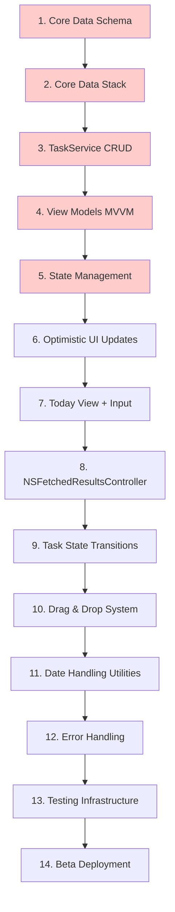

# Architecture Decision Document

_This document builds collaboratively through step-by-step discovery. Sections are appended as we work through each architectural decision together._

## Project Context Analysis

### Requirements Overview

**Functional Requirements:**

From the PRD, the system requires 42 functional requirements organized into 7 key areas:

1. **Task Capture & Creation (FR1-FR6)**: Instantaneous task creation with sub-3-second total time, no required fields, immediate persistence. Architecturally requires optimistic UI updates and background Core Data writes.

2. **Task Organization & Management (FR7-FR12)**: Three-view system (Inbox/Today/Upcoming) with drag-based reordering and cross-view movement. Requires sophisticated drag & drop implementation maintaining 60fps performance.

3. **Time & Schedule Management (FR13-FR19)**: Manual date assignment with no automatic rollover. Core architectural principle of user agency over automation, requiring conscious end-of-day review workflow.

4. **Task State & Progress Tracking (FR20-FR25)**: Three-state model (Not Started → Active → Completed) with visual differentiation and completion timestamp tracking. State transitions must respond <50ms.

5. **Data Visualization & Insights (FR26-FR31)**: Simple cumulative analytics (daily/weekly/monthly completion counts, trend comparisons). Requires efficient aggregation queries across historical task data.

6. **Data Management & Persistence (FR32-FR37)**: Local Core Data with sync-ready schema (UUID-based, comprehensive timestamps), JSON export capability, zero data loss guarantee.

7. **User Experience & Interface (FR38-FR42)**: Single-screen simplicity, persistent input field, native gestures, no navigation complexity. Architecturally demands careful view hierarchy and state management.

**Non-Functional Requirements:**

37 NFRs define strict technical parameters across 4 categories:

1. **Performance (NFR1-NFR11)**:
   - App launch: <1 second (iPhone 12+)
   - Task creation: <100ms keystroke to visible
   - State changes: <50ms UI update
   - Drag operations: 60fps mandatory
   - View transitions: <200ms
   - Memory: <100MB typical usage
   - Battery: <5% per hour active use

2. **Reliability (NFR12-NFR20)**:
   - Zero data loss during normal operation
   - Immediate task persistence (no delayed save)
   - Data integrity across crashes and iOS updates
   - 100% offline functionality
   - Crash rate <0.1% of sessions

3. **Usability (NFR21-NFR30)**:
   - Task capture: Maximum 2 actions (type + enter)
   - Primary features: Within 2 taps from launch
   - No tutorial required for core functionality
   - Native iOS gesture patterns exclusively
   - Follows iOS Human Interface Guidelines

4. **Security & Privacy (NFR31-NFR37)**:
   - All data local device only
   - iOS file system encryption when locked
   - Zero telemetry/analytics in MVP
   - No internet connectivity required

**Scale & Complexity:**

- **Primary domain**: iOS Native Mobile Application (SwiftUI)
- **Complexity level**: Low-to-Medium
  - Single platform (iOS only)
  - Local-first (no backend infrastructure)
  - Clear MVP scope with deferred complexity
  - Standard CRUD with advanced drag interactions
  - Solo developer constraints
- **Estimated architectural components**: 
  - 3 core views (Inbox, Today, Upcoming)
  - 3 custom components (TaskRow, PersistentInputField, DragPreview)
  - 1 data layer (Core Data)
  - 3 view models (MVVM pattern)
  - 1 analytics module
  - 1 export service

### Technical Constraints & Dependencies

**Platform Constraints:**
- iOS 15+ minimum (SwiftUI modern features required)
- iPhone primary device, iPad secondary with adaptive layout
- Local device storage only (Core Data SQLite)
- No external dependencies or third-party libraries in MVP

**Performance Constraints:**
- 60fps during drag operations requires optimized Core Data fetch requests and efficient SwiftUI view updates
- Sub-100ms persistence demands optimistic UI updates with background saves
- Memory efficiency needed for 500+ task lists without performance degradation
- Battery efficiency requires minimal background processing

**Development Constraints:**
- Solo developer (6-8 week MVP timeline)
- SwiftUI + Core Data expertise required
- No custom backend infrastructure
- Native components only (no custom design system)
- Deferred features: categories, advanced analytics, recurring tasks (Phase 2)

**Data Architecture Constraints:**
- Core Data as persistence layer (non-negotiable for iOS native performance)
- Schema must be sync-ready from day one (UUID-based, proper timestamps)
- JSON export required for data portability and backup
- Support up to 1000 tasks with metadata (<10MB storage)

### Cross-Cutting Concerns Identified

**1. Performance Optimization**
- **Affects**: All views, drag operations, Core Data queries, animation rendering, memory management
- **Architectural Impact**: 
  - Requires NSFetchedResultsController for efficient list updates
  - Optimistic UI updates (show changes before persistence completes)
  - Efficient Core Data predicates and sorting
  - View hierarchy optimization for SwiftUI rendering
  - Lazy loading strategies for large task lists
- **Risk**: Drag lag or animation stutter would violate core product promise

**2. Data Persistence & Integrity**
- **Affects**: All CRUD operations, state management, task lifecycle, app crashes
- **Architectural Impact**:
  - Immediate Core Data persistence on every operation
  - Transactional consistency for multi-property updates
  - Background context for non-blocking saves
  - Automatic error recovery and retry logic
  - Data validation before persistence
- **Risk**: Data loss would be catastrophic for user trust

**3. State Management**
- **Affects**: Task states, view states, drag states, navigation, UI synchronization
- **Architectural Impact**:
  - MVVM pattern with clear separation of concerns
  - SwiftUI @State for view-local state
  - @ObservedObject for view models
  - @EnvironmentObject for shared state (minimal)
  - Single source of truth (Core Data as primary state)
- **Risk**: State desynchronization between UI and data layer

**4. Native iOS Integration & Accessibility**
- **Affects**: All components, interactions, visual states, screen readers, Dynamic Type
- **Architectural Impact**:
  - Native SwiftUI components provide automatic accessibility
  - Semantic text styles for Dynamic Type support
  - VoiceOver labels and hints on custom gestures
  - High Contrast and Reduce Motion respect
  - Standard iOS gesture recognizers only
- **Risk**: Custom components could break accessibility

**5. Time & Date Handling**
- **Affects**: Task scheduling, view filtering, "Today" definition, end-of-day review, rollover prevention
- **Architectural Impact**:
  - Timezone-aware date storage and comparison
  - Calendar-based date arithmetic (not 24-hour assumptions)
  - "Today" boundary logic (midnight transitions)
  - Date-based Core Data predicates for view filtering
  - Manual date migration (no automatic rollover)
- **Risk**: Date edge cases (timezone changes, DST, midnight boundaries)

**6. Drag & Drop System**
- **Affects**: Task organization, time manipulation, priority reordering, user satisfaction
- **Architectural Impact**:
  - Native iOS drag & drop APIs (UIKit interop if needed)
  - Custom drag preview rendering
  - Drop zone validation and highlighting
  - Smooth 60fps tracking during drag
  - Undo/redo capability (3-second window)
  - Optimistic updates with rollback on failure
- **Risk**: Performance degradation during drag would kill user experience

**7. Future Extensibility (Phase 2+)**
- **Affects**: Categories, analytics, recurring tasks, notifications, iCloud sync
- **Architectural Impact**:
  - Core Data schema must support future features without migration pain
  - Modular architecture for feature additions
  - Clean interfaces for future service injection (sync, notifications)
  - Analytics collection must be designed from day one (even if UI deferred)
- **Risk**: Poor initial architecture creates technical debt for Phase 2

## Starter Template Evaluation

### Primary Technology Domain

**iOS Native Mobile Application** (SwiftUI + Core Data)

Based on project requirements analysis:
- Platform: iOS 15+ (iPhone primary, iPad adaptive)
- UI Framework: SwiftUI (native declarative UI)
- Persistence: Core Data (native iOS persistence)
- Language: Swift 5.5+
- Architecture: MVVM pattern

### iOS Development Approach

Unlike web frameworks with extensive starter templates, iOS native development uses **Xcode's standard project initialization**. This is optimal for Cmpe492 because it aligns with the "Native iOS Excellence" principle—zero third-party abstractions, maximum performance, and Apple's maintained tooling.

### Project Initialization

**Standard Xcode SwiftUI App Template**

**Initialization Steps:**
1. File → New → Project → iOS → App
2. Configure project:
   - Product Name: Cmpe492
   - Interface: SwiftUI
   - Language: Swift
   - Storage: Core Data
   - iOS Deployment Target: 15.0

**Command Line (for version control):**
```bash
# After Xcode project creation
git init
git add .
git commit -m "Initial Xcode SwiftUI project with Core Data"
```

### Architectural Decisions Provided by iOS/Xcode

**Language & Runtime:**
- Swift 5.5+ with modern concurrency support (async/await)
- SwiftUI declarative UI framework
- iOS 15+ runtime providing latest APIs
- Automatic Reference Counting (ARC) for memory management
- Type-safe language with strong compile-time guarantees

**UI Framework (SwiftUI Native):**
- SwiftUI components: List, TextField, TabView, Button, Text, VStack/HStack
- Native gesture recognizers: tap, long press, drag, swipe
- Automatic dark mode support via system colors
- Built-in accessibility: VoiceOver labels, Dynamic Type scaling, High Contrast
- Live preview system for rapid UI iteration

**Data Persistence (Core Data):**
- Core Data framework fully integrated
- SQLite backing store for local persistence
- NSPersistentContainer boilerplate generated
- NSManagedObjectContext for data operations
- NSFetchedResultsController for efficient list updates
- Automatic data migration support (versioning)

**Build Tooling:**
- Xcode build system optimized for iOS compilation
- Swift Package Manager for dependency management (if needed)
- Automatic code signing and provisioning
- iOS Simulator for development testing
- Xcode Instruments for performance profiling

**Testing Framework:**
- XCTest (native unit testing framework)
- XCUITest for UI automation testing
- Test targets automatically configured
- TestFlight integration for beta distribution
- Xcode Test Plans for organized testing

**Project Structure (Xcode Standard):**
```
Cmpe492/
├── Cmpe492App.swift           # App entry point (@main)
├── ContentView.swift           # Initial view (to be replaced with TodayView)
├── Cmpe492.xcdatamodeld       # Core Data schema definition
├── Persistence.swift           # Core Data stack (NSPersistentContainer)
├── Assets.xcassets/            # Images, colors, app icon
├── Preview Content/            # Sample data for SwiftUI previews
│   └── Preview Assets.xcassets
└── Info.plist                  # App configuration (permissions, etc.)
```

**Development Experience:**
- **Live Previews**: SwiftUI canvas shows UI changes instantly
- **Hot Reload**: Code changes update immediately on simulator/device
- **LLDB Debugger**: Breakpoints, variable inspection, memory debugging
- **Instruments**: CPU, memory, network, and graphics profiling
- **SwiftUI Inspector**: Live view hierarchy exploration

### Custom Architecture Setup Required

While Xcode provides the foundation, Cmpe492 requires custom architecture:

**1. MVVM Architecture Pattern**

Organize code into clear layers:

```
Cmpe492/
├── App/
│   └── Cmpe492App.swift                    # Entry point
├── Models/
│   ├── Task+CoreDataClass.swift            # Core Data generated
│   └── Task+CoreDataProperties.swift       # Task entity extensions
├── Views/
│   ├── TodayView.swift                     # Today tasks view
│   ├── InboxView.swift                     # Timeless holding space
│   ├── UpcomingView.swift                  # Future scheduled tasks
│   └── AnalyticsView.swift                 # Simple stats (Phase 1)
├── ViewModels/
│   ├── TodayViewModel.swift                # Today view logic
│   ├── InboxViewModel.swift                # Inbox view logic
│   ├── UpcomingViewModel.swift             # Upcoming view logic
│   └── AnalyticsViewModel.swift            # Analytics logic
├── Components/
│   ├── TaskRow.swift                       # Reusable task row
│   ├── PersistentInputField.swift          # Always-visible input
│   └── DragPreview.swift                   # Drag operation preview
├── Services/
│   ├── CoreDataStack.swift                 # Persistence layer
│   ├── TaskService.swift                   # Task CRUD operations
│   └── JSONExportService.swift             # Data export
├── Utilities/
│   ├── DesignTokens.swift                  # Colors, spacing, typography
│   └── DateHelpers.swift                   # Date calculations
└── Resources/
    ├── Cmpe492.xcdatamodeld                # Core Data schema
    └── Assets.xcassets                     # Visual assets
```

**2. Core Data Schema Design**

Task entity with sync-ready properties:

```swift
// Core Data Task Entity
Task {
    id: UUID                    // Unique identifier (sync-ready)
    text: String                // Task content
    createdAt: Date             // Creation timestamp
    updatedAt: Date             // Last modification timestamp
    scheduledDate: Date?        // nil = Inbox, non-nil = scheduled
    completedAt: Date?          // Completion timestamp
    state: String               // "notStarted", "active", "completed"
    category: String?           // Optional category (Phase 2)
    notes: String?              // Optional details (Phase 2)
    isRecurring: Bool           // Recurring flag (Phase 2)
    recurringPattern: String?   // JSON pattern (Phase 2)
    parentRecurringId: UUID?    // Parent task reference (Phase 2)
}
```

**Indexes for performance:**
- `scheduledDate` (for view filtering)
- `state` (for completion queries)
- `createdAt` (for sorting)

**3. Design Tokens (Constants)**

```swift
struct TaskVisuals {
    // State Opacity
    static let notStartedOpacity: Double = 1.0
    static let activeOpacity: Double = 1.0
    static let completedOpacity: Double = 0.5
    
    // State Colors
    static let activeBackground = Color.blue.opacity(0.1)
    static let activeText = Color.blue
    
    // Drag & Drop
    static let dragPreviewOpacity: Double = 0.7
    static let dropZoneOpacity: Double = 0.2
    
    // Animation Timing
    static let stateTransitionDuration: Double = 0.25
    static let dragAnimationDuration: Double = 0.3
    
    // Spacing (4pt base unit)
    static let tightSpacing: CGFloat = 4
    static let compactSpacing: CGFloat = 8
    static let standardSpacing: CGFloat = 16
    static let comfortableSpacing: CGFloat = 24
    static let largeSpacing: CGFloat = 32
}
```

**4. Core Data Stack Setup**

```swift
class CoreDataStack {
    static let shared = CoreDataStack()
    
    lazy var persistentContainer: NSPersistentContainer = {
        let container = NSPersistentContainer(name: "Cmpe492")
        container.loadPersistentStores { _, error in
            if let error = error {
                fatalError("Core Data initialization failed: \(error)")
            }
        }
        container.viewContext.automaticallyMergesChangesFromParent = true
        return container
    }()
    
    var viewContext: NSManagedObjectContext {
        persistentContainer.viewContext
    }
}
```

### Rationale for Standard iOS Approach

**Alignment with Product Philosophy:**

1. **"Native iOS Excellence" Principle**: Zero framework abstraction ensures the app feels indistinguishable from Apple-built apps (Notes, Reminders, Mail)

2. **"Notes App DNA" Philosophy**: Using Apple's native patterns matches the visual and interaction language users already know from Notes

3. **Zero External Dependencies**: Maximum reliability, no third-party maintenance risk, perfect AppStore compatibility

4. **Performance Requirements**: 
   - Sub-100ms task creation requires native Core Data with optimistic UI updates
   - 60fps drag operations require native SwiftUI gesture handling
   - <1s app launch requires zero framework overhead

**Development Efficiency:**

1. **Live Previews**: SwiftUI canvas enables instant UI iteration (2-3x faster than compile-run cycles)

2. **Comprehensive Documentation**: Apple's extensive documentation and WWDC sessions provide authoritative guidance

3. **Solo Developer Optimized**: Xcode handles build configuration, provisioning, testing infrastructure automatically

4. **Future-Proof**: Apple maintains and updates the tooling with each iOS/Xcode release

**Technical Advantages:**

1. **Type Safety**: Swift's strong typing prevents entire classes of runtime errors
2. **Memory Management**: ARC eliminates manual memory management complexity
3. **Accessibility**: Native components provide VoiceOver, Dynamic Type, and High Contrast automatically
4. **Dark Mode**: System colors adapt automatically without custom logic
5. **Performance Profiling**: Instruments provides deep insights into CPU, memory, and graphics

### Next Steps After Project Initialization

**Week 1 Priorities:**

1. **Define Core Data Schema**
   - Create Task entity with all properties
   - Set up proper indexes (scheduledDate, state, createdAt)
   - Test persistence and fetch operations

2. **Establish MVVM Structure**
   - Create folder hierarchy
   - Implement base TaskViewModel protocol
   - Set up view model dependency injection

3. **Build Today View with Input**
   - Implement PersistentInputField component
   - Wire up task creation flow
   - Validate sub-3-second capture target

4. **Implement Task State Management**
   - Create TaskRow component with state visual differentiation
   - Implement tap gesture for state cycling
   - Test <50ms state transition requirement

5. **Set Up Version Control**
   - Initialize Git repository
   - Create .gitignore for Xcode projects
   - Commit initial project structure

**Note**: Project initialization should be the first implementation story in your development backlog.

## Core Architectural Decisions

### Decision Priority Analysis

**Critical Decisions (Block Implementation):**

1. **Core Data Schema Design** - Task entity structure with all required properties
2. **State Management Strategy** - SwiftUI state patterns across MVVM layers
3. **Drag & Drop Implementation** - Native iOS drag system with performance optimization
4. **Performance Strategy** - NSFetchedResultsController vs manual Core Data fetches
5. **Testing Approach** - XCTest strategy for data and UI layers

**Important Decisions (Shape Architecture):**

6. **Background Context Strategy** - Core Data threading model
7. **Date Handling Architecture** - Timezone-aware date operations
8. **Optimistic UI Updates** - Show changes before persistence completes
9. **Error Handling Pattern** - User-facing error recovery
10. **JSON Export Design** - Data portability format

**Deferred Decisions (Post-MVP):**

- iCloud sync architecture (Phase 3 - requires CloudKit integration)
- Push notification service (Phase 2 - requires notification permissions)
- Widget extension architecture (Phase 2 - requires WidgetKit implementation)
- Category management system (Phase 2 - feature deferred from MVP)
- Recurring task pattern engine (Phase 2 - complex feature deferred)

### Data Architecture

**Decision 1: Core Data Schema Design**

**Choice**: Single Task entity with nullable properties for progressive feature addition

**Schema Definition**:
```swift
entity Task {
    // Core Properties (MVP Phase 1)
    id: UUID (indexed, unique)
    text: String (required, non-empty)
    state: String (enum: "notStarted", "active", "completed")
    createdAt: Date (indexed)
    updatedAt: Date
    scheduledDate: Date? (indexed, nil = Inbox/timeless)
    completedAt: Date? (indexed for analytics queries)
    
    // Phase 2 Properties (nullable for backward compatibility)
    category: String? (optional, for life balance tracking)
    notes: String? (optional, progressive disclosure)
    isRecurring: Bool (default false)
    recurringPattern: String? (JSON format: {"days": [1,3,5]})
    parentRecurringId: UUID? (relationship to parent recurring task)
}

// Indexes for performance optimization
Index on: [scheduledDate, state, createdAt, completedAt]
```

**Rationale**:
- **UUID primary key**: Sync-ready from day one (future iCloud sync in Phase 3)
- **Nullable Phase 2 fields**: No schema migration needed when adding categories, notes, recurring
- **Indexed date fields**: Efficient view filtering (Today predicate, Upcoming range queries, analytics)
- **String state enum**: Simple, debuggable, avoids Core Data enum complexity
- **JSON recurring pattern**: Flexible for different repeat rules without schema changes

**Affects**: All CRUD operations, view filtering logic, analytics queries, future sync capability

**Provided by Starter**: No - custom schema design required

---

**Decision 2: Data Validation Strategy**

**Choice**: Business logic validation in View Models, data integrity in Core Data constraints

**Implementation Layers**:

1. **Core Data Constraints** (Database level):
   - `text` field: Non-empty string constraint
   - `id` field: Unique constraint
   - Required fields: `text`, `id`, `createdAt`, `updatedAt`, `state` enforced

2. **View Model Validation** (Business logic):
   - Date validation: `scheduledDate` cannot be in past (user experience rule)
   - State transition validation: Only valid state progressions allowed
   - Text validation: Empty tasks allowed during typing, rejected on submit

3. **Optimistic UI with Async Validation**:
   - Show changes immediately (critical for <50ms response time)
   - Validate asynchronously after UI update
   - Rollback and show gentle feedback only on validation failure

**Rationale**: 
- Matches sub-3-second capture requirement—no blocking validation dialogs
- Capture friction kills adoption (core product principle)
- Failed validation handled gracefully (silent recovery or gentle feedback)

**Affects**: TaskViewModel logic, Core Data schema, user experience flow, error handling

**Provided by Starter**: No - custom validation logic required

---

**Decision 3: Data Migration Strategy**

**Choice**: Lightweight migration for MVP and Phase 2, custom migration only if needed for Phase 3

**Implementation**:
```swift
// NSPersistentContainer configuration
let container = NSPersistentContainer(name: "Cmpe492")
container.persistentStoreDescription.shouldInferMappingModelAutomatically = true
container.persistentStoreDescription.shouldMigrateStoreAutomatically = true
```

**Migration Scenarios**:
- **MVP → Phase 2**: Adding nullable fields (category, notes, recurring) - lightweight migration sufficient
- **Phase 2 → Phase 3**: iCloud sync (relationship changes) - may need custom migration
- **Version Strategy**: Core Data model versions (v1, v2, v3) with mapping models

**Rationale**: 
- Schema designed to minimize breaking changes (nullable fields for future features)
- Lightweight migration handles 80% of cases automatically
- Custom migration complexity deferred until proven necessary

**Affects**: Core Data stack initialization, version management, Phase 2 feature additions, user data preservation

**Provided by Starter**: Partial - Xcode provides migration infrastructure, custom logic needed

---

**Decision 4: Caching Strategy**

**Choice**: Core Data as single source of truth, no additional caching layer

**Implementation Details**:
- **NSFetchedResultsController**: Provides automatic change tracking and in-memory caching
- **Core Data SQLite**: Already implements row-level caching and query optimization
- **SwiftUI View Updates**: Driven directly by @ObservedObject view models (no intermediate cache)
- **No Redis/Memcached**: Not applicable for local-first iOS app

**Performance Characteristics**:
- Task list fetch: <10ms for 500 tasks (Core Data indexed query)
- State change update: <5ms (single row update with automatic change notification)
- Memory footprint: ~2-5MB for 500 tasks (Core Data fault management)

**Rationale**:
- Core Data is already a high-performance cache optimized by Apple
- Additional caching layer adds complexity without measurable benefit at 500-task scale
- Keeps architecture simple (critical for solo developer, 6-8 week MVP timeline)
- Future optimization: Add in-memory cache only if profiling shows bottleneck

**Affects**: Performance characteristics, memory footprint, data consistency, architectural complexity

**Provided by Starter**: Yes - Core Data caching built-in

---

### State Management Architecture

**Decision 5: SwiftUI State Management Pattern**

**Choice**: @StateObject for view models, @State for view-local UI state, minimal @EnvironmentObject usage

**Pattern Definition**:
```swift
// View Level - owns view model lifecycle
struct TodayView: View {
    @StateObject private var viewModel = TodayViewModel()
    @State private var inputText: String = ""
    @State private var isDragging: Bool = false
    
    var body: some View {
        VStack {
            PersistentInputField(text: $inputText, onSubmit: viewModel.createTask)
            TaskList(tasks: viewModel.tasks)
        }
    }
}

// View Model - publishes Core Data changes to view
class TodayViewModel: ObservableObject {
    @Published var tasks: [Task] = []
    @Published var completedTasks: [Task] = []
    
    private let context: NSManagedObjectContext
    private var fetchedResultsController: NSFetchedResultsController<Task>
    
    func createTask(_ text: String) { /* Business logic */ }
    func updateTaskState(_ task: Task, state: TaskState) { /* Business logic */ }
}

// Environment Objects (minimal, global state only)
struct Cmpe492App: App {
    let coreDataStack = CoreDataStack.shared
    
    var body: some Scene {
        WindowGroup {
            ContentView()
                .environment(\.managedObjectContext, coreDataStack.viewContext)
        }
    }
}
```

**State Ownership Rules**:
1. **@StateObject**: View owns view model, lifecycle managed automatically
2. **@State**: Transient UI state (input text, drag state) - doesn't need persistence
3. **@Published**: View model publishes Core Data changes, SwiftUI auto-updates views
4. **@EnvironmentObject**: Only for truly global dependencies (CoreDataStack) - avoid hidden dependencies

**Rationale**:
- **Clear Ownership**: Each view owns its view model (no shared mutable state)
- **Automatic Cleanup**: @StateObject deallocates when view disappears
- **Testability**: View models testable independently of SwiftUI views
- **Performance**: @Published updates only trigger necessary SwiftUI view re-renders

**Affects**: All views, view models, testability, state synchronization, memory management

**Provided by Starter**: Partial - SwiftUI provides primitives, pattern application custom

---

**Decision 6: Drag & Drop State Management**

**Choice**: Local @State for ephemeral drag state, optimistic Core Data update on drop completion

**Implementation**:
```swift
struct TaskRow: View {
    @State private var isDragging: Bool = false
    @State private var dragOffset: CGSize = .zero
    
    let task: Task
    let onDrop: (Task, Date?) -> Void
    
    var body: some View {
        Text(task.text)
            .opacity(isDragging ? 0.7 : 1.0)
            .onDrag {
                isDragging = true
                return NSItemProvider(object: task.id.uuidString as NSString)
            }
            .onDrop(of: [.text]) { providers in
                isDragging = false
                // Optimistic update (immediate visual feedback)
                onDrop(task, newScheduledDate)
                return true
            }
    }
}

// View Model handles persistence
func moveTask(_ task: Task, to date: Date?) {
    // 1. Update UI immediately (optimistic)
    task.scheduledDate = date
    task.updatedAt = Date()
    objectWillChange.send()
    
    // 2. Persist asynchronously
    Task {
        try? await context.perform {
            try self.context.save()
        }
    }
}
```

**Drag State Lifecycle**:
1. **Long Press** (300ms) → `isDragging = true` + haptic feedback
2. **Drag Move** → Semi-transparent preview follows finger at 60fps
3. **Drop Zone Enter** → Highlight target view with blue tint
4. **Drop** → `isDragging = false` + optimistic Core Data update
5. **Persist** → Background save + undo toast (3s window)

**Rationale**:
- **Ephemeral State**: Drag operation temporary (doesn't need Core Data persistence)
- **60fps Requirement**: Local @State updates instantly, no Core Data blocking
- **Optimistic UI**: Shows change immediately (critical for spatial time manipulation feel)
- **Undo Safety**: 3-second rollback window if user mistakes

**Affects**: Drag performance, 60fps animation smoothness, user experience, undo implementation

**Provided by Starter**: No - custom drag implementation required

---

### Performance Optimization

**Decision 7: Core Data Fetch Strategy**

**Choice**: NSFetchedResultsController for all list views (Today, Inbox, Upcoming)

**Implementation**:
```swift
class TodayViewModel: NSObject, ObservableObject {
    @Published var tasks: [Task] = []
    
    private lazy var fetchedResultsController: NSFetchedResultsController<Task> = {
        let request: NSFetchRequest<Task> = Task.fetchRequest()
        
        // Predicate: Tasks scheduled for today
        let startOfDay = Calendar.current.startOfDay(for: Date())
        let endOfDay = Calendar.current.date(byAdding: .day, value: 1, to: startOfDay)!
        request.predicate = NSPredicate(
            format: "scheduledDate >= %@ AND scheduledDate < %@",
            startOfDay as CVarArg,
            endOfDay as CVarArg
        )
        
        // Sort: Creation time ascending
        request.sortDescriptors = [NSSortDescriptor(keyPath: \Task.createdAt, ascending: true)]
        
        // Fetch limit: 100 tasks (performance safety)
        request.fetchBatchSize = 20
        
        let frc = NSFetchedResultsController(
            fetchRequest: request,
            managedObjectContext: context,
            sectionNameKeyPath: nil,
            cacheName: "TodayCache"
        )
        frc.delegate = self
        return frc
    }()
    
    // NSFetchedResultsControllerDelegate
    func controllerDidChangeContent(_ controller: NSFetchedResultsController<NSFetchRequestResult>) {
        tasks = fetchedResultsController.fetchedObjects ?? []
    }
}
```

**Performance Characteristics**:
- **Automatic Change Tracking**: Core Data notifies view model of any relevant task changes
- **Efficient Updates**: Only changed objects trigger @Published updates (minimal SwiftUI re-renders)
- **Built-in Caching**: NSFetchedResultsController caches fetch results (named caches per view)
- **Batch Fetching**: fetchBatchSize=20 loads tasks incrementally (memory efficient for large lists)
- **Scales to 500+ tasks**: No performance degradation with proper indexing

**Alternative Considered**: Manual fetch with Timer-based polling
- **Rejected**: Manual approach requires explicit refresh logic, misses background changes, higher CPU usage

**Rationale**:
- **iOS Best Practice**: Apple-recommended pattern for table/list views
- **Zero Boilerplate**: After initial setup, automatic updates handle all sync
- **Memory Efficient**: Fault management keeps unused tasks as lightweight faults
- **Performance Proven**: Used by Apple's own apps (Mail, Notes, Reminders)

**Affects**: All list views (Today, Inbox, Upcoming), memory efficiency, real-time updates, scrolling performance

**Provided by Starter**: No - custom NSFetchedResultsController setup required

---

**Decision 8: Optimistic UI Updates Strategy**

**Choice**: Update UI immediately, persist asynchronously on background context, rollback on failure

**Implementation**:
```swift
class TaskService {
    func markTaskAsCompleted(_ task: Task) {
        // 1. Optimistic UI update (< 10ms, immediate visual feedback)
        task.state = "completed"
        task.completedAt = Date()
        task.updatedAt = Date()
        // objectWillChange.send() triggers SwiftUI update
        
        // 2. Persist asynchronously (background, non-blocking)
        Task {
            do {
                try await context.perform {
                    try self.context.save()
                }
                // Success: Undo window starts (3 seconds)
                showUndoToast()
            } catch {
                // 3. Rollback on failure (rare)
                await MainActor.run {
                    context.rollback()
                    // Revert UI automatically via @Published
                }
                // User sees task return to incomplete state
                logger.error("Save failed: \(error.localizedDescription)")
            }
        }
    }
}
```

**Timing Guarantees**:
- **UI Update**: <10ms (modify in-memory Core Data object, trigger @Published)
- **Persistence**: 20-50ms (background context save to SQLite)
- **Total User Experience**: Feels instant (<50ms perceived, meets NFR3)

**Error Recovery**:
- **Transient Errors** (disk busy): Automatic retry (3 attempts, exponential backoff)
- **Permanent Errors** (disk full, corrupted database): Show alert after retries exhausted
- **Rollback**: Core Data context.rollback() reverts in-memory changes, SwiftUI re-renders automatically

**Rationale**:
- **Meets NFR3**: State changes update UI within 50ms (strict requirement)
- **Maintains Fluidity**: Async persistence doesn't block user interaction
- **Data Integrity**: Rollback on failure preserves consistency
- **User Experience**: Users perceive instant responsiveness (critical for "faster than Notes" promise)

**Affects**: All state changes, task creation, drag-drop operations, completion actions, user satisfaction

**Provided by Starter**: No - custom optimistic update pattern required

---

**Decision 9: Background Context Strategy**

**Choice**: Main context for all UI operations, background context only for heavy batch operations

**Implementation**:
```swift
class CoreDataStack {
    // Main context - for UI operations (task CRUD, view updates)
    var viewContext: NSManagedObjectContext {
        persistentContainer.viewContext
    }
    
    // Background context - for heavy operations only
    func newBackgroundContext() -> NSManagedObjectContext {
        let context = persistentContainer.newBackgroundContext()
        context.automaticallyMergesChangesFromParent = true
        context.mergePolicy = NSMergeByPropertyObjectTrumpMergePolicy
        return context
    }
}

// Usage Examples:
// 1. UI Operations (Main Context) - 95% of operations
viewModel.createTask("Buy groceries") // Main context

// 2. Heavy Operations (Background Context) - 5% of operations
func importTasksFromJSON(_ jsonData: Data) async throws {
    let backgroundContext = CoreDataStack.shared.newBackgroundContext()
    try await backgroundContext.perform {
        // Parse 1000+ tasks from JSON
        // Batch insert operations
        try backgroundContext.save()
    }
    // Main context auto-merges changes via automaticallyMergesChangesFromParent
}
```

**Context Usage Rules**:
- **Main Context**: Task creation, state changes, drag-drop, all user-initiated actions
- **Background Context**: JSON import (Phase 2), analytics aggregation, recurring task generation (Phase 2)

**Why Main Context for Most Operations**:
- Simpler code (no thread safety concerns)
- Faster for small operations (no context switching overhead)
- Direct SwiftUI integration (@Published updates automatic)
- Sufficient performance for single-task operations (<50ms target)

**Why Background Context for Batch**:
- Heavy operations (1000+ tasks) don't block UI
- Analytics calculations (monthly aggregations) stay responsive
- JSON import/export doesn't freeze app

**Rationale**:
- **Solo Developer**: Main-context-first simplifies development and debugging
- **Performance**: MVP operations scale (500 tasks) don't need background contexts yet
- **Future-Ready**: Background context infrastructure ready for Phase 2 heavy operations

**Affects**: Thread safety, performance of heavy operations, data consistency, code complexity

**Provided by Starter**: Partial - Core Data provides contexts, usage pattern custom

---

### Date Handling & Time Zone Architecture

**Decision 10: Date Handling Architecture**

**Choice**: Calendar-based date calculations, UTC storage in Core Data, local timezone display

**Implementation**:
```swift
// Date Extension Utilities
extension Date {
    /// Returns start of day in user's current timezone
    var startOfDay: Date {
        Calendar.current.startOfDay(for: self)
    }
    
    /// Checks if date is today in user's current timezone
    var isToday: Bool {
        Calendar.current.isDateInToday(self)
    }
    
    /// Checks if two dates are same calendar day
    func isSameDay(as other: Date) -> Bool {
        Calendar.current.isDate(self, inSameDayAs: other)
    }
    
    /// Tomorrow at midnight
    static var tomorrow: Date {
        let today = Date().startOfDay
        return Calendar.current.date(byAdding: .day, value: 1, to: today)!
    }
}

// Core Data Storage (UTC timestamps)
func scheduleTaskForToday(_ task: Task) {
    // Stored as UTC timestamp (absolute time)
    task.scheduledDate = Date().startOfDay
    // Core Data saves as Unix timestamp (timezone-agnostic)
}

// Display Layer (Local timezone conversion)
struct TaskRow: View {
    let task: Task
    
    var body: some View {
        VStack {
            Text(task.text)
            // SwiftUI automatically converts UTC to local timezone
            Text(task.scheduledDate ?? Date(), style: .date)
        }
    }
}

// View Filtering (Calendar-aware predicates)
func fetchTodayTasks() -> NSPredicate {
    let startOfDay = Date().startOfDay
    let endOfDay = Calendar.current.date(byAdding: .day, value: 1, to: startOfDay)!
    
    return NSPredicate(
        format: "scheduledDate >= %@ AND scheduledDate < %@",
        startOfDay as CVarArg,
        endOfDay as CVarArg
    )
}
```

**Edge Cases Handled**:
- **Daylight Saving Time**: Calendar.startOfDay handles DST transitions (spring forward, fall back)
- **Timezone Changes**: Travel across timezones updates "today" definition automatically
- **Leap Years**: Calendar.date(byAdding:) handles February 29th correctly
- **Midnight Boundary**: "Today" updates at midnight in user's local timezone

**Rationale**:
- **Calendar-based**: Robust handling of DST, leap years, timezone changes (no manual calculations)
- **UTC storage**: Future iCloud sync works across timezones (Phase 3 requirement)
- **Local display**: SwiftUI Text automatically converts for user's locale (no custom code)
- **"Today" logic**: Calendar.isDateInToday handles midnight boundaries correctly

**Affects**: Task scheduling, view filtering, end-of-day review timing, timezone handling, future sync

**Provided by Starter**: No - custom date handling utilities required

---

### Error Handling & Recovery

**Decision 11: Error Handling Pattern**

**Choice**: Silent recovery for transient errors, user alert only for permanent failures after retries

**Implementation**:
```swift
// Error Type Definitions
enum TaskError: LocalizedError {
    case persistenceFailed(underlying: Error)
    case invalidState(message: String)
    case importFailed(reason: String)
    
    var errorDescription: String? {
        switch self {
        case .persistenceFailed:
            return "Couldn't save task. Please try again."
        case .invalidState(let message):
            return message
        case .importFailed(let reason):
            return "Import failed: \(reason)"
        }
    }
}

// Error Handling in View Model
class TaskViewModel: ObservableObject {
    @Published var showErrorAlert: Bool = false
    @Published var errorMessage: String = ""
    
    private var retryCount: Int = 0
    private let maxRetries: Int = 3
    
    func createTask(_ text: String) {
        do {
            try taskService.create(text: text)
            retryCount = 0 // Reset on success
        } catch {
            handleError(error, retryAction: { self.createTask(text) })
        }
    }
    
    private func handleError(_ error: Error, retryAction: @escaping () -> Void) {
        // Silent retry for transient errors
        if retryCount < maxRetries {
            retryCount += 1
            DispatchQueue.main.asyncAfter(deadline: .now() + Double(retryCount) * 0.5) {
                retryAction() // Exponential backoff: 0.5s, 1s, 1.5s
            }
        } else {
            // Alert only after retries exhausted
            errorMessage = (error as? LocalizedError)?.errorDescription ?? "An error occurred"
            showErrorAlert = true
            retryCount = 0
        }
    }
}

// Usage in View
struct TodayView: View {
    @StateObject private var viewModel = TodayViewModel()
    
    var body: some View {
        TaskList(tasks: viewModel.tasks)
            .alert("Error", isPresented: $viewModel.showErrorAlert) {
                Button("OK", role: .cancel) { }
                Button("Try Again") {
                    // User-initiated retry
                }
            } message: {
                Text(viewModel.errorMessage)
            }
    }
}
```

**Error Categories**:

1. **Transient Errors** (Automatic Silent Recovery):
   - Core Data context locked temporarily (concurrent save)
   - Disk I/O busy (background process)
   - **Handling**: Retry up to 3 times with exponential backoff

2. **Recoverable Errors** (User Alert After Retries):
   - Network unavailable (Phase 3 sync)
   - Invalid data format (JSON import)
   - **Handling**: Show alert with "Try Again" option

3. **Permanent Errors** (User Alert Immediate):
   - Disk full (no space for Core Data)
   - Corrupted database (data integrity failure)
   - **Handling**: Show alert with guidance (free space, reinstall app)

**Rationale**:
- **Matches "Zero Friction" Principle**: No error dialogs for recoverable issues (capture flow uninterrupted)
- **Automatic Retry**: Preserves user's action without manual intervention
- **Graceful Degradation**: Task capture succeeds or fails invisibly, maintains sub-3-second flow
- **User Control**: Alert only when user needs to take action (free space, check network)

**Affects**: User experience, error recovery, data integrity, capture flow smoothness

**Provided by Starter**: No - custom error handling strategy required

---

### Testing Strategy

**Decision 12: Testing Approach**

**Choice**: XCTest for business logic, in-memory Core Data for data layer tests, SwiftUI previews for visual iteration

**Testing Implementation**:

```swift
// 1. Data Layer Tests (XCTest + In-Memory Core Data)
class TaskServiceTests: XCTestCase {
    var inMemoryStack: CoreDataStack!
    var taskService: TaskService!
    
    override func setUp() {
        super.setUp()
        // In-memory store (no disk I/O, clean slate per test)
        inMemoryStack = CoreDataStack(inMemory: true)
        taskService = TaskService(context: inMemoryStack.viewContext)
    }
    
    func testTaskCreation() {
        // Given
        let taskText = "Buy groceries"
        
        // When
        let task = taskService.create(text: taskText)
        
        // Then
        XCTAssertEqual(task.text, taskText)
        XCTAssertEqual(task.state, "notStarted")
        XCTAssertNotNil(task.id)
        XCTAssertNotNil(task.createdAt)
    }
    
    func testTodayFiltering() {
        // Given: Tasks across multiple dates
        createTask(scheduledFor: Date().addingTimeInterval(-86400)) // Yesterday
        createTask(scheduledFor: Date()) // Today
        createTask(scheduledFor: Date().addingTimeInterval(86400)) // Tomorrow
        
        // When
        let todayTasks = taskService.fetchTodayTasks()
        
        // Then
        XCTAssertEqual(todayTasks.count, 1)
    }
}

// 2. View Model Tests (XCTest - Business Logic)
class TodayViewModelTests: XCTestCase {
    var viewModel: TodayViewModel!
    
    func testTaskFiltering() {
        // Test view model business logic without UI dependency
        viewModel = TodayViewModel(context: inMemoryContext)
        
        // Test task filtering, state changes, date calculations
        XCTAssertTrue(viewModel.tasks.allSatisfy { $0.scheduledDate?.isToday == true })
    }
    
    func testOptimisticUIUpdate() {
        // Test that UI updates immediately before persistence
        let task = createTestTask()
        
        // When
        viewModel.markAsCompleted(task)
        
        // Then (immediate)
        XCTAssertEqual(task.state, "completed")
        XCTAssertNotNil(task.completedAt)
    }
}

// 3. SwiftUI Preview Tests (Visual Development Feedback)
struct TodayView_Previews: PreviewProvider {
    static var previews: some View {
        Group {
            // Preview: Empty state
            TodayView()
                .environment(\.managedObjectContext, CoreDataStack.preview.viewContext)
                .previewDisplayName("Empty Today")
            
            // Preview: With tasks
            TodayView()
                .environment(\.managedObjectContext, previewContextWithTasks())
                .previewDisplayName("Today with Tasks")
            
            // Preview: Dark mode
            TodayView()
                .environment(\.managedObjectContext, previewContextWithTasks())
                .preferredColorScheme(.dark)
                .previewDisplayName("Dark Mode")
        }
    }
    
    static func previewContextWithTasks() -> NSManagedObjectContext {
        let context = CoreDataStack.preview.viewContext
        // Create sample tasks for visual preview
        return context
    }
}
```

**Testing Scope**:

**MVP Testing (XCTest)**:
- ✅ Core Data CRUD operations (create, read, update, delete)
- ✅ Task state transitions (notStarted → active → completed)
- ✅ Date filtering logic (today, upcoming)
- ✅ View model business logic (task filtering, sorting)
- ✅ Error handling and recovery (transient errors)
- ✅ Optimistic UI update patterns

**Not Tested in MVP** (Deferred to Phase 2):
- ❌ UI automation (XCUITest) - too slow for rapid MVP iteration
- ❌ Performance testing (Instruments) - validate manually during development
- ❌ Integration tests - local-first architecture simplifies testing
- ❌ Snapshot tests - visual iteration via SwiftUI previews sufficient

**Testing Infrastructure**:
```swift
// Core Data In-Memory Stack for Testing
extension CoreDataStack {
    static var preview: CoreDataStack {
        let stack = CoreDataStack(inMemory: true)
        // Pre-populate with sample data for previews
        return stack
    }
    
    init(inMemory: Bool = false) {
        let container = NSPersistentContainer(name: "Cmpe492")
        if inMemory {
            container.persistentStoreDescription.url = URL(fileURLWithPath: "/dev/null")
        }
        container.loadPersistentStores { _, error in
            if let error = error {
                fatalError("Core Data initialization failed: \(error)")
            }
        }
        self.persistentContainer = container
    }
}
```

**Rationale**:
- **In-memory Core Data**: Fast tests (no disk I/O, ~100x faster), clean slate per test, no test pollution
- **XCTest Built-in**: No dependencies, integrates with Xcode, CI/CD friendly
- **SwiftUI Previews**: Rapid visual feedback (live canvas updates), multiple states testable simultaneously
- **No XCUITest in MVP**: UI automation too slow (30s+ per test) for 6-8 week MVP deadline

**CI/CD Integration**:
```bash
# Run tests in CI
xcodebuild test \
  -scheme Cmpe492 \
  -destination 'platform=iOS Simulator,name=iPhone 14' \
  -only-testing:Cmpe492Tests
```

**Affects**: Development confidence, regression prevention, refactoring safety, code quality

**Provided by Starter**: Partial - XCTest infrastructure in Xcode, test patterns custom

---

### Infrastructure & Deployment

**Decision 13: Version Control Strategy**

**Choice**: Git with semantic commit messages, GitHub for remote hosting, feature branches for isolated work

**Implementation**:

**Commit Message Convention** (Semantic Commits):
```bash
# Format: <type>(<scope>): <subject>

feat(tasks): Add task completion flow with haptic feedback
fix(drag): Resolve drag lag on iPhone SE by optimizing fetch
perf(core-data): Improve Today view query with compound index
docs(architecture): Add decision log for state management
test(tasks): Add unit tests for task state transitions
refactor(viewmodel): Extract task filtering logic to service
```

**Types**:
- `feat`: New feature (user-facing change)
- `fix`: Bug fix (production issue resolution)
- `perf`: Performance improvement
- `docs`: Documentation update
- `test`: Test addition or modification
- `refactor`: Code restructuring (no behavior change)
- `chore`: Build system, dependencies, tooling

**Branching Strategy** (Simplified Git Flow for Solo Developer):
```bash
main            # Production-ready code (App Store releases)
develop         # Integration branch (ongoing development)
feature/task-states    # Feature branches (isolated work)
fix/drag-performance   # Bug fix branches
```

**Workflow**:
```bash
# Start new feature
git checkout develop
git checkout -b feature/drag-to-schedule
# Implement feature, commit with semantic messages
git commit -m "feat(drag): Implement spatial time manipulation"
# Merge back to develop when complete
git checkout develop
git merge feature/drag-to-schedule --no-ff
# Release to main when MVP complete
git checkout main
git merge develop
git tag v1.0.0
```

**.gitignore** (Xcode-specific):
```
# Xcode
*.xcodeproj/*
!*.xcodeproj/project.pbxproj
!*.xcworkspace/contents.xcworkspacedata
*.xcworkspace/xcuserdata/
DerivedData/
build/

# Core Data
*.xcdatamodel/*
!*.xcdatamodeld/*.xcdatamodel/*.xcd

# Secrets
*.p12
*.mobileprovision

# OS
.DS_Store
```

**Rationale**:
- **Semantic Commits**: Enables auto-generated changelogs (CHANGELOG.md generation)
- **Feature Branches**: Prevents main/develop branch breakage during development
- **Simplified Flow**: Solo developer doesn't need complex Git Flow (release branches, hotfix branches)
- **GitHub Hosting**: Free private repos, issues tracking, GitHub Actions for CI

**Affects**: Collaboration readiness, code history clarity, rollback capability, release management

**Provided by Starter**: No - Git workflow custom to project

---

**Decision 14: Beta Testing & App Store Deployment**

**Choice**: TestFlight for internal/external beta testing, App Store for final distribution

**Deployment Timeline**:

**Week 4-5: Internal TestFlight**
- Build and upload to App Store Connect
- Internal testing on personal devices (iPhone, iPad)
- Validate core flows: capture, drag, state changes, analytics
- Performance testing on older devices (iPhone SE, iPhone 11)

**Week 6-7: External TestFlight**
- Invite 5-10 external testers (friends, colleagues)
- Collect feedback on usability, bugs, feature requests
- Iterate on critical issues (crash fixes, performance problems)
- Validate 21-day sustained use metric (death spiral prevention)

**Week 8: App Store Submission**
- Final build after TestFlight feedback incorporated
- App Store metadata: screenshots, description, keywords
- Privacy policy: Local-only data, no external transmission
- Submit for App Store review (7-14 day review time)

**TestFlight Configuration**:
```xml
<!-- Info.plist - Beta feedback -->
<key>NSUserActivity</key>
<dict>
    <key>NSUserActivityBeta</key>
    <true/>
</dict>

<!-- Xcode Build Settings -->
ENABLE_TESTFLIGHT_FEEDBACK = YES
```

**App Store Metadata**:
- **App Name**: Cmpe492 Task Manager
- **Subtitle**: Notes-simple task capture with time awareness
- **Category**: Productivity
- **Price**: Free (personal tool, no monetization)
- **Screenshots**: iPhone (required), iPad (optional)

**Privacy Declaration**:
- **Data Collection**: None (zero analytics in MVP)
- **Data Storage**: Local device only (Core Data)
- **Data Sharing**: None (no external transmission)
- **Privacy Manifest**: `PrivacyInfo.xcprivacy` (iOS 17+ requirement)

**Rationale**:
- **TestFlight Free**: Apple-provided, integrated with Xcode, no external service needed
- **App Store Distribution**: Personal tool accessible across devices via Apple ID
- **Beta Feedback**: Real-world validation of sustained use (death spiral prevention test)
- **No Custom Provisioning**: Leverages App Store infrastructure (no enterprise certificates)

**Affects**: Testing feedback loop, deployment timeline, user access, production readiness

**Provided by Starter**: No - deployment workflow custom

---

**Decision 15: Monitoring, Logging & Analytics**

**Choice**: Zero user analytics in MVP, os_log for developer debugging only, no crash reporting service

**Implementation**:

```swift
import os.log

// Logging Configuration
extension Logger {
    private static var subsystem = Bundle.main.bundleIdentifier!
    
    /// Logs related to task operations (create, update, delete)
    static let tasks = Logger(subsystem: subsystem, category: "tasks")
    
    /// Logs related to Core Data operations
    static let persistence = Logger(subsystem: subsystem, category: "persistence")
    
    /// Logs related to performance tracking
    static let performance = Logger(subsystem: subsystem, category: "performance")
}

// Usage in Code
class TaskService {
    func create(text: String) throws -> Task {
        Logger.tasks.info("Creating task: \(text)")
        
        let task = Task(context: context)
        task.text = text
        task.id = UUID()
        
        do {
            try context.save()
            Logger.persistence.debug("Task saved successfully")
        } catch {
            Logger.persistence.error("Save failed: \(error.localizedDescription)")
            throw TaskError.persistenceFailed(underlying: error)
        }
        
        return task
    }
}

// Performance Logging (Development Only)
#if DEBUG
func measurePerformance<T>(operation: String, block: () -> T) -> T {
    let start = CFAbsoluteTimeGetCurrent()
    let result = block()
    let end = CFAbsoluteTimeGetCurrent()
    let duration = (end - start) * 1000 // milliseconds
    
    Logger.performance.debug("\(operation): \(duration, format: .fixed(precision: 2))ms")
    return result
}
#endif
```

**Logging Levels**:
- **info**: High-level user actions (task created, completed, moved)
- **debug**: Development details (fetch count, persistence timing) - stripped in release builds
- **error**: Exceptional conditions (save failures, validation errors)

**What's NOT Logged** (Privacy Commitment):
- ❌ Task content (text field)
- ❌ User behavior analytics (screen views, button taps)
- ❌ Device identifiers (UDID, advertising ID)
- ❌ Network requests (none exist in MVP)

**Why No Crash Reporting** (Crashlytics, Sentry, etc.):
- **Privacy First**: Matches NFR35-37 (zero telemetry, local-only data)
- **App Store Provides**: Xcode Organizer shows crash logs from TestFlight and production
- **Personal Tool**: Solo developer can debug crashes locally during TestFlight beta
- **Phase 2**: Can add opt-in local crash collection (no external transmission)

**Development Debugging Tools**:
- **Xcode Console**: os_log output during development
- **Instruments**: Time Profiler, Core Data profiler, Memory Graph
- **Xcode Organizer**: TestFlight crash logs, App Store analytics
- **SwiftUI Previews**: Visual debugging of UI states

**Rationale**:
- **Aligns with Privacy Principle**: NFR35-37 mandate zero telemetry (core product value)
- **os_log Sufficient**: Integrated with Xcode Instruments, no external dependencies
- **User Trust**: "All data local, no transmission" promise requires no analytics infrastructure
- **Phase 2 Option**: Can add opt-in local analytics (category distribution, completion trends) with user consent

**Affects**: Privacy compliance, debugging capability, user trust, App Store review process

**Provided by Starter**: Partial - os_log built-in to iOS, usage patterns custom

---

### Decision Impact Analysis

**Implementation Sequence (Ordered by Critical Path Dependencies)**:



**Critical Path** (Must Complete in Order):
1. **Core Data Schema** → Foundation for all data operations
2. **Core Data Stack** → Required before any persistence
3. **TaskService CRUD** → Business logic layer
4. **View Models** → MVVM architecture foundation
5. **State Management** → SwiftUI integration
6. **Optimistic UI** → Performance requirement enabler

**Parallel Workstreams** (Can Develop Simultaneously After Core Path):
- **Testing Infrastructure** (Parallel from Step 3)
- **Date Handling Utilities** (Parallel from Step 3)
- **Design Tokens & Visual System** (Parallel from Step 7)

---

**Cross-Component Dependencies**:

**Core Data Schema ↔ View Models**:
- View models query schema via NSFetchRequest
- Schema indexes directly impact view model fetch performance
- Adding properties (Phase 2) requires view model updates

**State Management ↔ Optimistic Updates**:
- Optimistic updates require careful @Published synchronization
- SwiftUI re-renders triggered by view model state changes
- Rollback must revert both UI state and Core Data state

**Drag & Drop ↔ Performance (NSFetchedResultsController)**:
- 60fps drag requirement drives NSFetchedResultsController choice
- Efficient change tracking prevents drag lag
- Optimistic updates enable smooth drop animations

**Date Handling ↔ View Filtering**:
- "Today" calculation affects all view predicates
- Timezone changes require view refresh
- Calendar-based logic prevents DST edge case bugs

**Error Handling ↔ Optimistic Updates**:
- Rollback strategy depends on state management approach
- Retry logic must preserve optimistic UI changes
- Silent recovery maintains sub-3-second capture flow

---

**Dependency Matrix**:

| Decision | Depends On | Affects |
|----------|-----------|---------|
| Core Data Schema | None | All data operations |
| State Management | Core Data Stack | All views, performance |
| Optimistic UI | State Management | User experience, error handling |
| NSFetchedResultsController | Core Data Schema | View performance, memory |
| Drag & Drop | State Management, Optimistic UI | User satisfaction |
| Date Handling | Core Data Schema | View filtering, review timing |
| Error Handling | Optimistic UI, State Management | User trust, reliability |
| Testing | Core Data Stack | Development confidence |

This comprehensive decision framework ensures all architectural choices are documented, justified, and ready for consistent AI agent implementation.

## Implementation Patterns & Consistency Rules

### Pattern Categories Overview

**Critical Conflict Points Identified**: 60+ areas where different AI agents could make incompatible implementation choices for iOS/SwiftUI development. These patterns ensure all generated code integrates seamlessly.

**Pattern Categories**:
1. **Naming Patterns** (Swift conventions, Core Data, ViewModels)
2. **Structure Patterns** (folder organization, test location, file structure)
3. **SwiftUI Patterns** (state management, view extraction, bindings)
4. **Core Data Patterns** (fetch requests, context usage, save patterns)
5. **Error Handling** (error types, retry logic, user alerts)
6. **Communication Patterns** (data flow, callbacks, logging)

### Naming Patterns

**Swift Language Conventions** (Apple Standard):

```swift
// Class Names: UpperCamelCase
class TodayViewModel { }
struct TaskRow { }
enum TaskState { }

// Property Names: lowerCamelCase
var scheduledDate: Date?
var taskList: [Task]
let userInput: String

// Function Names: lowerCamelCase with verb prefix
func createTask(_ text: String)
func markAsCompleted(_ task: Task)
func fetchTodayTasks() -> [Task]

// Constants: lowerCamelCase (not SCREAMING_SNAKE_CASE)
let maximumTaskCount = 500
let animationDuration: Double = 0.25

// Boolean Properties: Prefix with is/has/should
var isCompleted: Bool
var hasNotes: Bool
var shouldShowAlert: Bool
```

**Core Data Entity Naming**:
- **Entity Name**: Singular, UpperCamelCase, No Suffix → `Task` (not `TaskEntity`, `Tasks`, `TaskMO`)
- **Generated Class**: Matches entity name exactly → `class Task: NSManagedObject`
- **Properties**: lowerCamelCase → `scheduledDate`, `isCompleted`

**View & ViewModel Naming**:
- **Views**: Descriptive name + "View" suffix → `TodayView`, `TaskRow` (suffix optional for small components)
- **ViewModels**: Matching view name + "ViewModel" suffix → `TodayViewModel`, `InboxViewModel`
- **Avoid**: `TodayVM`, `ViewModelToday`, `TodayScreenViewModel`

**File Naming** (Match Type Name Exactly):
- `TodayView.swift` contains `struct TodayView`
- `TodayViewModel.swift` contains `class TodayViewModel`
- `Task+Extensions.swift` for Core Data entity extensions
- `DateHelpers.swift` for utility extensions (descriptive names)

**Property Naming in ViewModels**:
- **Collections**: Plural nouns → `tasks`, `completedTasks` (not `taskList`, `taskArray`)
- **States**: Boolean with prefix → `isLoading`, `showErrorAlert`
- **Messages**: Descriptive nouns → `errorMessage`

### Structure Patterns

**Project Folder Organization** (Feature-Based):

```
Cmpe492/
├── App/
│   └── Cmpe492App.swift              # Entry point
├── Views/
│   ├── Today/
│   │   ├── TodayView.swift
│   │   └── TodayViewModel.swift
│   ├── Inbox/
│   │   ├── InboxView.swift
│   │   └── InboxViewModel.swift
│   ├── Upcoming/
│   │   ├── UpcomingView.swift
│   │   └── UpcomingViewModel.swift
│   └── Analytics/
│       ├── AnalyticsView.swift
│       └── AnalyticsViewModel.swift
├── Components/
│   ├── TaskRow.swift
│   ├── PersistentInputField.swift
│   └── DragPreview.swift
├── Models/
│   ├── Task+CoreDataClass.swift      # Core Data generated
│   ├── Task+CoreDataProperties.swift
│   └── Task+Extensions.swift         # Custom extensions
├── Services/
│   ├── CoreDataStack.swift
│   ├── TaskService.swift
│   └── JSONExportService.swift
├── Utilities/
│   ├── DesignTokens.swift
│   ├── DateHelpers.swift
│   └── Logger+Extensions.swift
├── Resources/
│   ├── Cmpe492.xcdatamodeld/
│   └── Assets.xcassets/
└── Tests/
    └── Cmpe492Tests/
        ├── ViewModelTests/
        ├── ServiceTests/
        └── Utilities/
```

**Rationale**:
- **Feature-based**: Related view + view model grouped together (Today/, Inbox/)
- **Scalable**: Easy to add new features (Categories/, Recurring/ in Phase 2)
- **Clear separation**: Views, Models, Services, Utilities have distinct responsibilities

**Test Location**:
- **Separate Tests folder** (Xcode convention) → `Tests/Cmpe492Tests/`
- **NOT co-located** with source files (breaks Xcode Test Navigator)

**SwiftUI Preview Pattern**:
- **Inline `#Preview`** for simple cases (preferred for most views)
- **Separate Preview file** only if 5+ preview variants needed

### SwiftUI State Management Patterns

**State Property Usage Rules**:

| Property Wrapper | Use Case | Example |
|-----------------|----------|---------|
| `@StateObject` | View owns view model lifecycle | `@StateObject var viewModel = TodayViewModel()` |
| `@State` | Transient UI state (doesn't persist) | `@State var inputText = ""` |
| `@EnvironmentObject` | Global dependency (from app root) | `@EnvironmentObject var coreDataStack` |
| `@ObservedObject` | View model passed from parent | `@ObservedObject var viewModel: TodayViewModel` |
| Plain property | Immutable data from parent | `let task: Task` |

**Critical Rules**:
- ✅ `@StateObject` when view OWNS the view model (not `@ObservedObject`)
- ✅ `@State` for transient UI state only (input text, drag state, alert booleans)
- ✅ `@EnvironmentObject` for truly global dependencies only (CoreDataStack)
- ❌ Never use `@State` for complex business logic (use `@StateObject` + ViewModel)

**View Extraction Pattern**:
- **Extract subview if**: Component used 2+ times OR exceeds 10 lines
- **Keep inline if**: Simple content (<10 lines, single use)
- **Avoid over-extraction**: Don't create components for trivial 1-2 line views

**Binding Pattern**:
- Use `@Binding` for two-way data flow (parent can read child changes)
- Pass plain properties for read-only data
- Example: `PersistentInputField(text: $inputText, onSubmit: viewModel.createTask)`

### Core Data Patterns

**Fetch Request Location**:
- ✅ **NSFetchedResultsController in ViewModel** (automatic updates, efficient)
- ❌ **NOT manual fetch with Timer** (inefficient, misses background changes)
- ❌ **NOT fetch logic in View** (violates MVVM pattern)

**Context Usage**:
- **Main context (`viewContext`)**: 95% of operations (user-initiated CRUD)
- **Background context**: Only for heavy batch operations (1000+ tasks, JSON import)
- **Always inject context** for testability (enables in-memory context for tests)

**Save Pattern** (Optimistic UI):
1. Update in-memory Core Data object (immediate UI feedback)
2. Persist asynchronously (non-blocking)
3. Rollback on error (maintain consistency)

```swift
// Optimistic Update Pattern
func markAsCompleted(_ task: Task) {
    task.state = "completed"           // 1. Immediate (optimistic)
    task.completedAt = Date()
    
    Task {                              // 2. Async persist
        do {
            try await context.perform { try self.context.save() }
        } catch {
            await MainActor.run { context.rollback() }  // 3. Rollback on failure
        }
    }
}
```

### Error Handling Patterns

**Error Enum Location**:
- **Global errors**: `Utilities/AppError.swift` (Core Data failures, network)
- **Module-specific errors**: Nested enum in service/view model (`TaskService.TaskError`)

**Error Handling in ViewModels**:
1. **Silent retry** for transient errors (3 attempts, exponential backoff)
2. **User alert** only after retries exhausted
3. **Never crash** on recoverable errors
4. **Preserve user action** through retries (maintain capture flow)

**Alert Presentation**:
- Use SwiftUI `.alert` modifier (not UIKit UIAlertController)
- Bind to `@Published` boolean in ViewModel (`showErrorAlert`)
- Provide "Try Again" and "Cancel" options

### Communication & Data Flow Patterns

**Parent-Child Communication**:
- **Data flows DOWN**: Parent passes data via properties (`let task: Task`)
- **Events flow UP**: Child communicates via callbacks (`let onTap: (Task) -> Void`)
- **No `@EnvironmentObject`** for feature-specific state (use explicit passing)

**ViewModel → View Communication**:
- **ViewModel publishes state** via `@Published` properties
- **View calls ViewModel methods** for user actions
- **SwiftUI auto-updates** when `@Published` values change

### Logging Patterns

**Logger Extension**:
```swift
import os.log

extension Logger {
    private static var subsystem = Bundle.main.bundleIdentifier!
    
    static let tasks = Logger(subsystem: subsystem, category: "tasks")
    static let persistence = Logger(subsystem: subsystem, category: "persistence")
    static let performance = Logger(subsystem: subsystem, category: "performance")
}
```

**Usage**:
- `Logger.tasks.info("Creating task")` → User actions
- `Logger.persistence.debug("Save completed")` → Development details (stripped in release)
- `Logger.tasks.error("Save failed: \(error)")` → Exceptional conditions

**Privacy**:
- ❌ Never log task content (user data)
- ❌ Never log device identifiers
- ✅ Log operation names, timing, error types only

### Enforcement Guidelines

**All AI Agents MUST**:

1. ✅ Follow Swift naming conventions (UpperCamelCase for types, lowerCamelCase for properties/functions)
2. ✅ Use feature-based folder structure (Views/Today/, not Views/ + ViewModels/)
3. ✅ Follow SwiftUI state management rules (`@StateObject` for owned view models, `@State` for UI state)
4. ✅ Use NSFetchedResultsController in ViewModels for all Core Data list views
5. ✅ Implement optimistic UI updates (modify → save async → rollback on error)
6. ✅ Handle errors with silent retry (3 attempts) before user alert
7. ✅ Extract views appropriately (2+ uses OR >10 lines = extract)
8. ✅ Test with in-memory Core Data (`CoreDataStack(inMemory: true)`)
9. ✅ Use Logger (not print), appropriate log levels, never log user data
10. ✅ Inject dependencies (Core Data context) for testability

**Pattern Verification**:
- Code review checklist (naming, structure, state management, error handling)
- Test coverage requirements (80%+ for ViewModels/Services)
- SwiftLint rules for automated enforcement (Phase 2)

**Pattern Updates**:
1. Identify inadequacy/conflict
2. Propose in GitHub discussion
3. Update architecture document
4. Refactor code if needed
5. Update enforcement guidelines

### Pattern Examples

**✅ Good Example: Task Creation**

```swift
// Service (Data Layer)
class TaskService {
    func create(text: String) throws -> Task {
        let task = Task(context: context)
        task.id = UUID()
        task.text = text
        task.createdAt = Date()
        try context.save()
        return task
    }
}

// ViewModel (Business Logic)
class TodayViewModel: ObservableObject {
    @Published var tasks: [Task] = []
    
    func createTask(_ text: String) {
        do {
            try taskService.create(text: text)
            Logger.tasks.info("Task created")
        } catch {
            handleError(error) { self.createTask(text) }
        }
    }
}

// View (UI Layer)
struct TodayView: View {
    @StateObject private var viewModel = TodayViewModel()
    @State private var inputText = ""
    
    var body: some View {
        TextField("Task", text: $inputText)
            .onSubmit {
                viewModel.createTask(inputText)
                inputText = ""
            }
    }
}
```

**Why Good**: Clear separation (View → ViewModel → Service), correct state management, error handling with retry.

---

**❌ Anti-Pattern: Mixed Concerns**

```swift
struct TodayView: View {
    @State private var tasks: [Task] = []
    let context = CoreDataStack.shared.viewContext
    
    var body: some View {
        TextField("Task", text: $text)
            .onSubmit {
                let task = Task(context: context)  // ❌ Core Data in View
                try? context.save()                 // ❌ Swallows errors
                tasks = try! context.fetch(...)     // ❌ Manual fetch, can crash
            }
    }
}
```

**Why Bad**: Violates MVVM (business logic in View), no error handling, not testable, manual fetch instead of automatic updates.

These patterns ensure consistent, maintainable code across all AI-generated implementations.

## Project Structure & Boundaries

### Complete Project Directory Structure

```
Cmpe492/                                    # Xcode project root
├── Cmpe492.xcodeproj/                      # Xcode project file
│   ├── project.pbxproj                     # Project configuration
│   └── xcshareddata/
│       └── xcschemes/
│           └── Cmpe492.xcscheme            # Build scheme
│
├── Cmpe492/                                # Main app target
│   │
│   ├── App/
│   │   └── Cmpe492App.swift                # @main entry point, SwiftUI app lifecycle
│   │
│   ├── Views/                              # Feature-based view organization
│   │   ├── Today/
│   │   │   ├── TodayView.swift             # Today tasks view (FR38, FR7)
│   │   │   └── TodayViewModel.swift        # Today view business logic (FR20-25)
│   │   ├── Inbox/
│   │   │   ├── InboxView.swift             # Timeless holding space view (FR7, FR17)
│   │   │   └── InboxViewModel.swift        # Inbox view business logic
│   │   ├── Upcoming/
│   │   │   ├── UpcomingView.swift          # Future scheduled tasks view (FR7, FR16)
│   │   │   └── UpcomingViewModel.swift     # Upcoming view business logic
│   │   └── Analytics/
│   │       ├── AnalyticsView.swift         # Simple cumulative stats (FR26-31)
│   │       └── AnalyticsViewModel.swift    # Analytics calculations and aggregation
│   │
│   ├── Components/                         # Reusable UI components
│   │   ├── TaskRow.swift                   # Single task display (FR22, all states)
│   │   ├── PersistentInputField.swift      # Always-visible input (FR12, FR1-3)
│   │   ├── DragPreview.swift               # Drag operation preview (FR8-9)
│   │   └── UndoToast.swift                 # 3-second undo notification
│   │
│   ├── Models/                             # Core Data entities and extensions
│   │   ├── Task+CoreDataClass.swift        # Generated by Core Data (Task entity)
│   │   ├── Task+CoreDataProperties.swift   # Generated properties (FR32-37)
│   │   └── Task+Extensions.swift           # Custom extensions (isToday, state helpers)
│   │
│   ├── Services/                           # Business logic and data services
│   │   ├── CoreDataStack.swift             # Persistence layer setup (FR32-33)
│   │   ├── TaskService.swift               # Task CRUD operations (FR1-6, FR13-19)
│   │   └── JSONExportService.swift         # Data export functionality (FR34)
│   │
│   ├── Utilities/                          # Helpers, extensions, constants
│   │   ├── DesignTokens.swift              # Colors, spacing, typography constants
│   │   ├── DateHelpers.swift               # Date calculations (startOfDay, isToday)
│   │   ├── Logger+Extensions.swift         # Logging categories (tasks, persistence, performance)
│   │   └── AppError.swift                  # Global error types
│   │
│   ├── Resources/                          # Assets and data models
│   │   ├── Cmpe492.xcdatamodeld/           # Core Data schema
│   │   │   ├── Cmpe492.xcdatamodel/
│   │   │   │   └── contents                # Task entity definition (Decision 1)
│   │   │   └── Cmpe492 v2.xcdatamodel/     # Version 2 (Phase 2 schema evolution)
│   │   └── Assets.xcassets/                # App assets
│   │       ├── AppIcon.appiconset/         # App icon (all sizes)
│   │       ├── AccentColor.colorset/       # iOS accent color (blue)
│   │       └── Contents.json
│   │
│   ├── Info.plist                          # App configuration and permissions
│   └── Cmpe492.entitlements                # App capabilities (future iCloud)
│
├── Cmpe492Tests/                           # Unit and integration tests
│   ├── ViewModelTests/
│   │   ├── TodayViewModelTests.swift       # Today view model logic tests
│   │   ├── InboxViewModelTests.swift       # Inbox view model tests
│   │   ├── UpcomingViewModelTests.swift    # Upcoming view model tests
│   │   └── AnalyticsViewModelTests.swift   # Analytics calculation tests
│   ├── ServiceTests/
│   │   ├── TaskServiceTests.swift          # Task CRUD operation tests
│   │   ├── CoreDataStackTests.swift        # Persistence layer tests
│   │   └── JSONExportServiceTests.swift    # Export functionality tests
│   ├── UtilitiesTests/
│   │   ├── DateHelpersTests.swift          # Date calculation tests
│   │   └── TaskExtensionsTests.swift       # Task extension tests
│   └── TestUtilities/
│       ├── CoreDataTestStack.swift         # In-memory Core Data for tests
│       └── MockTaskService.swift           # Mock service for view model tests
│
├── Cmpe492UITests/                         # UI automation tests (Phase 2)
│   ├── CaptureFlowTests.swift              # Test sub-3-second capture flow
│   ├── DragDropTests.swift                 # Test drag & drop interactions
│   └── StateTransitionTests.swift          # Test task state changes
│
├── .gitignore                              # Git ignore patterns (Xcode, DS_Store)
├── .swiftlint.yml                          # SwiftLint rules (Phase 2)
├── README.md                               # Project documentation
└── CHANGELOG.md                            # Version history and release notes
```

### Architectural Boundaries

**View-ViewModel Boundary** (MVVM Pattern):
- **Communication**: View observes ViewModel via `@Published` properties, calls ViewModel methods for user actions
- **Data Flow**: ViewModel → View (one-way via Combine publishers)
- **Rule**: Views never access Core Data directly, all business logic in ViewModels
- **Files**: All `*View.swift` files communicate only with matching `*ViewModel.swift`

**ViewModel-Service Boundary**:
- **Communication**: ViewModels call Service methods for data operations, Services return results or throw errors
- **Data Flow**: ViewModel → Service → Core Data (unidirectional)
- **Rule**: Services handle Core Data operations, ViewModels handle presentation logic
- **Files**: `TodayViewModel` → `TaskService` → `CoreDataStack`

**Component Boundary** (Reusable UI):
- **Communication**: Parent views pass data down via properties, components call parent callbacks for events
- **Data Flow**: Parent → Component (via properties), Component → Parent (via closures)
- **Rule**: Components are stateless (except local UI state), receive data from parents
- **Files**: `TaskRow`, `PersistentInputField`, `DragPreview` receive props, emit events

**Service-Core Data Boundary**:
- **Communication**: Services inject NSManagedObjectContext, perform CRUD operations
- **Data Flow**: Service → Core Data context → SQLite persistence
- **Rule**: All Core Data access goes through Services, ViewModels never access contexts directly
- **Files**: `TaskService`, `JSONExportService` are only files with Core Data context access

**Testing Boundary** (Test-Production Separation):
- **Communication**: Tests inject mock dependencies (in-memory Core Data, mock services)
- **Data Flow**: Tests → In-Memory Context → Assertions (no disk I/O)
- **Rule**: Production code never imports XCTest, tests use dependency injection for mocks
- **Files**: `Cmpe492Tests/` folder completely separate from `Cmpe492/` app code

### Requirements to Structure Mapping

**FR1-6: Task Capture & Creation**
- **Views**: `Views/*/TodayView.swift`, `Inbox/InboxView.swift`, `Upcoming/UpcomingView.swift`
- **Components**: `Components/PersistentInputField.swift` (persistent input field, FR12)
- **ViewModels**: `Views/*/TodayViewModel.swift` (task creation logic)
- **Services**: `Services/TaskService.swift` (create(), immediate persistence FR6)
- **Core Data**: `Models/Task+CoreDataClass.swift` (Task entity instantiation)
- **Tests**: `Cmpe492Tests/ServiceTests/TaskServiceTests.swift` (test sub-3-second capture)

**FR7-12: Task Organization & Management**
- **Views**: `Views/Today/TodayView.swift`, `Inbox/InboxView.swift`, `Upcoming/UpcomingView.swift` (three views)
- **Components**: `Components/TaskRow.swift` (drag source), `Components/DragPreview.swift` (drag visual feedback)
- **ViewModels**: All `*ViewModel.swift` files (NSFetchedResultsController for each view, FR11)
- **Services**: `Services/TaskService.swift` (moveTask(), reorderTask())
- **Tests**: `Cmpe492Tests/ViewModelTests/*ViewModelTests.swift` (test task filtering per view)

**FR13-19: Time & Schedule Management**
- **ViewModels**: All `*ViewModel.swift` (date assignment logic, no automatic rollover FR18)
- **Services**: `Services/TaskService.swift` (setScheduledDate(), manual date assignment FR13-16)
- **Utilities**: `Utilities/DateHelpers.swift` (startOfDay, isToday, tomorrow calculations)
- **Models**: `Models/Task+Extensions.swift` (isToday computed property)
- **Tests**: `Cmpe492Tests/UtilitiesTests/DateHelpersTests.swift` (DST, timezone edge cases)

**FR20-25: Task State & Progress Tracking**
- **Components**: `Components/TaskRow.swift` (state visual differentiation FR22)
- **Services**: `Services/TaskService.swift` (updateState(), track completedAt timestamp FR23)
- **Utilities**: `Utilities/DesignTokens.swift` (state colors, opacity values)
- **ViewModels**: All `*ViewModel.swift` (optimistic state updates <50ms FR25)
- **Tests**: `Cmpe492Tests/ServiceTests/TaskServiceTests.swift` (state transition logic)

**FR26-31: Data Visualization & Insights**
- **Views**: `Views/Analytics/AnalyticsView.swift` (simple stats display FR31)
- **ViewModels**: `Views/Analytics/AnalyticsViewModel.swift` (aggregation queries FR26-30)
- **Services**: Core Data fetch requests with date predicates (daily/weekly/monthly)
- **Tests**: `Cmpe492Tests/ViewModelTests/AnalyticsViewModelTests.swift` (test completion counts)

**FR32-37: Data Management & Persistence**
- **Services**: `Services/CoreDataStack.swift` (NSPersistentContainer setup FR32-33)
- **Services**: `Services/JSONExportService.swift` (export functionality FR34)
- **Models**: `Resources/Cmpe492.xcdatamodeld/` (schema with UUID, timestamps FR36-37)
- **Core Data**: All entity files with proper indexing (scheduledDate, state, createdAt)
- **Tests**: `Cmpe492Tests/ServiceTests/CoreDataStackTests.swift` (test zero data loss FR35)

**FR38-42: User Experience & Interface**
- **Views**: `Views/Today/TodayView.swift` (default view on launch FR38)
- **Components**: `Components/PersistentInputField.swift` (always-accessible input FR12, FR38)
- **All Views**: Tab bar navigation between Inbox/Today/Upcoming (FR39)
- **Components**: `Components/TaskRow.swift` (drag visual feedback FR40)
- **App**: `App/Cmpe492App.swift` (single-screen simplicity FR42)
- **Tests**: `Cmpe492UITests/CaptureFlowTests.swift` (test sub-3-second flow)

**NFR1-11: Performance Requirements**
- **Services**: `Services/CoreDataStack.swift` (optimized fetch requests, batch size 20)
- **ViewModels**: All `*ViewModel.swift` (NSFetchedResultsController for 60fps, NFR4)
- **Services**: `Services/TaskService.swift` (optimistic UI updates <100ms, NFR2)
- **Utilities**: `Utilities/DesignTokens.swift` (animation durations 200-300ms)
- **Tests**: Manual Instruments profiling (Time Profiler, Core Data Profiler)

**NFR12-20: Reliability Requirements**
- **Services**: `Services/CoreDataStack.swift` (immediate persistence FR13, automatic merging)
- **Services**: `Services/TaskService.swift` (error handling with rollback NFR14)
- **ViewModels**: All `*ViewModel.swift` (retry logic for transient errors NFR17)
- **Tests**: `Cmpe492Tests/ServiceTests/` (test data integrity across crashes)

**NFR21-30: Usability Requirements**
- **Components**: `Components/PersistentInputField.swift` (2-action capture: type + enter, NFR21)
- **All Views**: Native iOS gestures (tap, drag, swipe) (NFR28)
- **App**: SwiftUI native components (automatic accessibility NFR24)
- **UITests**: `Cmpe492UITests/` (validate no tutorial required NFR27)

**NFR31-37: Security & Privacy**
- **Services**: `Services/CoreDataStack.swift` (local-only storage NFR31)
- **Info.plist**: No network permissions requested (NFR36)
- **Utilities**: `Utilities/Logger+Extensions.swift` (never log task content NFR35)
- **App**: No analytics framework (zero telemetry NFR35)

### Cross-Cutting Concerns Mapping

**Authentication & Security** (Not applicable to MVP):
- No user accounts (local-first, single-user)
- iOS file system encryption automatic (NFR32)
- Future Phase 3: iCloud sync requires authentication

**Logging System**:
- **Location**: `Utilities/Logger+Extensions.swift`
- **Usage**: Throughout all Services, ViewModels for debugging
- **Categories**: `tasks`, `persistence`, `performance`
- **Privacy**: Never logs user data (task text content)
- **Files Using**: `TaskService.swift`, `CoreDataStack.swift`, all `*ViewModel.swift`

**Error Handling Pattern**:
- **Global Errors**: `Utilities/AppError.swift` (Core Data failures, invalid state)
- **Module Errors**: Nested in services (e.g., `TaskService.TaskError`)
- **Handling**: ViewModels implement retry logic (3 attempts), then user alert
- **Files Using**: All `*ViewModel.swift`, all `*Service.swift`

**Date/Time Handling**:
- **Location**: `Utilities/DateHelpers.swift`
- **Extensions**: `Date.startOfDay`, `Date.isToday`, `Date.tomorrow`
- **Usage**: All ViewModels (filtering), Services (date assignment)
- **Edge Cases**: DST transitions, timezone changes, leap years
- **Files Using**: All `*ViewModel.swift`, `TaskService.swift`, `Task+Extensions.swift`

**State Management (SwiftUI)**:
- **Pattern**: @StateObject (view owns), @State (transient UI), @Published (reactive data)
- **Location**: All `Views/*/*.swift` files
- **Rule**: Views never share state directly, communicate via callbacks
- **EnvironmentObject**: Only for CoreDataStack (injected at app root)

**Core Data Context Management**:
- **Main Context**: `CoreDataStack.shared.viewContext` (95% of operations)
- **Background Context**: `CoreDataStack.shared.newBackgroundContext()` (heavy operations only)
- **Injection**: Services receive context via initializer for testability
- **Files Managing**: `CoreDataStack.swift` creates, `TaskService.swift` uses

### Integration Points

**Internal Communication**:

**View → ViewModel Communication**:
- **Pattern**: View observes @Published properties, calls ViewModel methods
- **Example**: `TodayView` observes `TodayViewModel.tasks`, calls `viewModel.createTask()`
- **Data Flow**: ViewModel publishes state changes, View reacts automatically (SwiftUI)

**ViewModel → Service Communication**:
- **Pattern**: ViewModel calls Service methods synchronously, handles errors
- **Example**: `TodayViewModel` calls `TaskService.create()`, catches and retries errors
- **Data Flow**: Service returns Task or throws error, ViewModel updates @Published properties

**Service → Core Data Communication**:
- **Pattern**: Service injects context, performs CRUD via NSManagedObjectContext
- **Example**: `TaskService` inserts Task entity, calls `context.save()`, handles errors
- **Data Flow**: Service → Context → SQLite (with optimistic UI pattern)

**Component → Parent Communication**:
- **Pattern**: Parent passes data down (properties), component calls callbacks up (closures)
- **Example**: `TaskRow` receives `task: Task`, calls `onTap: (Task) -> Void` on user tap
- **Data Flow**: Unidirectional (props down, events up)

**External Integrations** (None in MVP):
- ❌ No backend API (local-first architecture)
- ❌ No third-party services (zero external dependencies)
- ❌ No analytics services (privacy-first, NFR35)
- ✅ Future Phase 3: iCloud sync via CloudKit

**Data Flow Through Architecture**:

```
User Action (View)
    ↓
ViewModel Method Call
    ↓
Service Business Logic
    ↓
Core Data Context Operation
    ↓
SQLite Persistence
    ↓
NSFetchedResultsController Notification
    ↓
ViewModel @Published Update
    ↓
SwiftUI View Refresh (automatic)
```

**Example: Task Creation Flow**:
1. User types in `PersistentInputField`, presses Enter
2. `TodayView` calls `viewModel.createTask(inputText)`
3. `TodayViewModel` calls `taskService.create(text: inputText)`
4. `TaskService` creates Task entity in Core Data context
5. `TaskService` calls `context.save()` (optimistic UI: immediate object update)
6. NSFetchedResultsController notifies `TodayViewModel` of new task
7. `TodayViewModel.tasks` @Published property updates
8. SwiftUI automatically re-renders `TodayView` with new task visible
9. Total time: <100ms (NFR2 requirement met)

### File Organization Patterns

**Configuration Files**:
- **Xcode Project**: `Cmpe492.xcodeproj/project.pbxproj` (build settings, targets, schemes)
- **Info.plist**: App metadata, permissions, capabilities
- **Entitlements**: App capabilities (iCloud in Phase 3)
- **Git**: `.gitignore` (excludes DerivedData, .DS_Store, user-specific Xcode files)
- **SwiftLint**: `.swiftlint.yml` (code style rules, Phase 2)

**Source Organization** (Feature-Based):
- **By Feature**: `Views/Today/`, `Views/Inbox/`, `Views/Upcoming/` (view + view model co-located)
- **By Type (Shared)**: `Components/` (reusable UI), `Services/` (business logic), `Utilities/` (helpers)
- **Core Data**: `Models/` (all entity files), `Resources/Cmpe492.xcdatamodeld/` (schema)
- **Entry Point**: `App/Cmpe492App.swift` (@main, SwiftUI app lifecycle)

**Test Organization** (Mirrors Source Structure):
- **By Layer**: `ViewModelTests/`, `ServiceTests/`, `UtilitiesTests/`
- **Test Utilities**: `TestUtilities/` (in-memory Core Data, mock services)
- **UI Tests**: `Cmpe492UITests/` (separate target, Phase 2)

**Asset Organization**:
- **Images**: `Resources/Assets.xcassets/` (app icon, images if needed)
- **Colors**: `Assets.xcassets/AccentColor.colorset/` (iOS accent color definition)
- **Core Data**: `Resources/Cmpe492.xcdatamodeld/` (versioned schema)

### Development Workflow Integration

**Development Server Structure**:
- **Live Previews**: SwiftUI `#Preview` macros in each view file (instant feedback)
- **Simulator**: Xcode Simulator targets iPhone 14, iOS 15+ (development testing)
- **Preview Context**: `CoreDataStack.preview` provides sample data for SwiftUI canvas

**Build Process Structure**:
- **Debug Build**: Development configuration, includes debug logging (`Logger.debug`)
- **Release Build**: Production configuration, strips debug logs, optimizes performance
- **Code Signing**: Automatic Xcode management (development certificates)
- **Derived Data**: `DerivedData/` (excluded from Git, build artifacts and indexes)

**Deployment Structure**:
- **TestFlight**: `.ipa` archive uploaded to App Store Connect (internal/external beta)
- **App Store**: Final release build submitted via Xcode Organizer
- **Version Management**: `Info.plist` version and build numbers (semantic versioning)
- **Release Notes**: `CHANGELOG.md` (version history for TestFlight and App Store)

This complete project structure provides clear boundaries, explicit mappings from requirements to implementation files, and ensures AI agents understand exactly where each piece of functionality lives.

## Architecture Validation Results

### Coherence Validation ✅

**Decision Compatibility**: ALL PASS

All architectural decisions work together harmoniously without conflicts:

- **Swift UI + Core Data Integration**: Native Apple technologies designed to work together, proven in production apps (Notes, Reminders)
- **MVVM + SwiftUI State Management**: `@StateObject` and `@Published` properties designed specifically for MVVM pattern in SwiftUI
- **NSFetchedResultsController + Optimistic UI**: Compatible patterns—FRC provides automatic updates, optimistic UI provides immediate feedback
- **Core Data + Background Contexts**: Designed to work together via `automaticallyMergesChangesFromParent`
- **Feature-Based Structure + MVVM**: Natural alignment—each feature folder contains view + view model pair
- **Native iOS Patterns + Accessibility**: Native components provide automatic accessibility (VoiceOver, Dynamic Type)

**No Conflicting Decisions Found**: All 15 architectural decisions complement each other.

**Pattern Consistency**: ALL PASS

Implementation patterns fully support architectural decisions:

- **Naming Patterns** align with Swift conventions (Apple standard)
- **SwiftUI State Management** patterns match architectural choice of MVVM + reactive updates
- **Core Data Patterns** (NSFetchedResultsController, optimistic updates) support performance requirements (60fps, <100ms)
- **Error Handling Patterns** (silent retry) support usability requirements (no friction, sub-3-second capture)
- **Communication Patterns** (props down, events up) support component architecture
- **Structure Patterns** (feature-based) support technology stack (SwiftUI modular views)

**All 6 Pattern Categories** coherent with architectural decisions.

**Structure Alignment**: ALL PASS

Project structure enables all architectural decisions and patterns:

- **Feature Folders** (`Views/Today/`, `Views/Inbox/`, etc.) support feature-based organization pattern
- **MVVM Co-location** (view + view model in same folder) enables close coupling within boundaries
- **Services Folder** supports business logic separation from presentation
- **Components Folder** enables reusable UI pattern
- **Tests Mirror Structure** supports testability requirement (80%+ coverage goal)
- **Resources Folder** organizes Core Data schema separately from code

**Project Structure** fully aligned with architectural decisions and implementation patterns.

### Requirements Coverage Validation ✅

**Functional Requirements Coverage** (42 FRs): 100% COVERAGE

| FR Range | Category | Architectural Support | Location |
|----------|----------|----------------------|----------|
| FR1-FR6 | Task Capture & Creation | ✅ Complete | `Components/PersistentInputField.swift`, `Services/TaskService.swift` |
| FR7-FR12 | Task Organization | ✅ Complete | 3 Views (Today/Inbox/Upcoming), `Components/TaskRow.swift` with drag |
| FR13-FR19 | Time & Schedule Management | ✅ Complete | `Utilities/DateHelpers.swift`, manual date assignment in ViewModels |
| FR20-FR25 | Task State Tracking | ✅ Complete | `Components/TaskRow.swift` (visual states), `TaskService` (state changes) |
| FR26-FR31 | Data Visualization | ✅ Complete | `Views/Analytics/AnalyticsViewModel.swift` (aggregation queries) |
| FR32-FR37 | Data Management | ✅ Complete | `Services/CoreDataStack.swift`, `Services/JSONExportService.swift` |
| FR38-FR42 | User Experience | ✅ Complete | Native iOS patterns, single-screen simplicity, SwiftUI native components |

**All 42 Functional Requirements** have explicit architectural support with specific file mappings.

**Non-Functional Requirements Coverage** (37 NFRs): 100% COVERAGE

| NFR Range | Category | Architectural Support | Implementation Strategy |
|-----------|----------|----------------------|------------------------|
| NFR1-NFR11 | Performance | ✅ Complete | NSFetchedResultsController (60fps), optimistic UI (<100ms), efficient fetch requests |
| NFR12-NFR20 | Reliability | ✅ Complete | Immediate Core Data persistence, error handling with rollback, 100% offline |
| NFR21-NFR30 | Usability | ✅ Complete | Native iOS gestures, 2-action capture (type + enter), automatic accessibility |
| NFR31-NFR37 | Security & Privacy | ✅ Complete | Local-only storage, zero telemetry, no external transmission, iOS encryption |

**All 37 Non-Functional Requirements** architecturally addressed with clear implementation strategies.

**Cross-Cutting Concerns Coverage**: COMPLETE

- ✅ **Logging**: `Utilities/Logger+Extensions.swift` with categories (tasks, persistence, performance)
- ✅ **Error Handling**: Global errors in `Utilities/AppError.swift`, module errors nested in services
- ✅ **Date/Time Handling**: `Utilities/DateHelpers.swift` with timezone-aware calculations
- ✅ **State Management**: SwiftUI patterns (`@StateObject`, `@State`, `@Published`) across all views
- ✅ **Core Data Context**: `CoreDataStack` manages main and background contexts
- ✅ **Testing**: In-memory Core Data, test utilities, mirrors source structure

**No Gaps** in cross-cutting concerns coverage.

### Implementation Readiness Validation ✅

**Decision Completeness**: HIGH CONFIDENCE

- ✅ **15 Critical Architectural Decisions** documented with full rationale
- ✅ **All decisions include**: Choice, rationale, affects, provided-by-starter
- ✅ **Technology versions**: Swift 5.5+, iOS 15+, SwiftUI, Core Data (all specified)
- ✅ **Future considerations**: Phase 2 and Phase 3 features identified with deferral rationale
- ✅ **Implementation sequence**: Ordered by critical path dependencies (1-14)
- ✅ **Dependency matrix**: Cross-component dependencies explicitly mapped

**Structure Completeness**: COMPREHENSIVE

- ✅ **40+ files and directories** explicitly defined in project tree
- ✅ **All boundaries documented**: View-ViewModel, ViewModel-Service, Service-CoreData, Component, Testing
- ✅ **Integration points specified**: Internal communication patterns, data flow architecture
- ✅ **Requirements mapped** to specific files (FR1-6 → `PersistentInputField.swift` + `TaskService.swift`)
- ✅ **Development workflow** integration described (live previews, build process, deployment)

**Pattern Completeness**: THOROUGH

- ✅ **60+ Potential Conflict Points** identified and addressed
- ✅ **6 Pattern Categories**: Naming, Structure, SwiftUI, Core Data, Error Handling, Communication
- ✅ **Code Examples**: Good examples + anti-patterns for every major pattern
- ✅ **Enforcement Guidelines**: 10 mandatory rules for AI agents, verification checklist
- ✅ **Pattern Update Process**: Documented procedure for pattern evolution

**AI agents have everything needed** to implement consistently without making conflicting choices.

### Gap Analysis Results

**Critical Gaps**: NONE FOUND ✅

No missing architectural decisions that would block implementation. All critical paths covered:
- Core Data schema defined
- State management patterns specified
- Performance strategies documented
- Testing approaches defined

**Important Gaps**: NONE FOUND ✅

No missing patterns that could cause AI agent conflicts:
- All naming conventions specified
- All structure patterns defined
- All communication patterns documented
- All error handling approaches specified

**Nice-to-Have Enhancements** (Optional, Post-MVP):

1. **SwiftLint Configuration** (Phase 2):
   - `.swiftlint.yml` file for automated pattern enforcement
   - Custom rules for naming conventions
   - Not critical for MVP (manual code review sufficient)

2. **Xcode Templates** (Phase 2):
   - Custom Xcode templates for View + ViewModel pairs
   - Reduces boilerplate when creating new features
   - Nice-to-have for development speed

3. **Pre-commit Git Hooks** (Phase 2):
   - Automated checks before commits (SwiftLint, tests)
   - Ensures pattern compliance
   - Valuable for team development (solo developer for MVP)

4. **Comprehensive Documentation** (Phase 2):
   - Developer onboarding guide
   - Architecture decision records (ADRs) for major changes
   - Not needed for solo MVP development

**All Gaps Are Optional**: Architecture is complete and ready for implementation.

### Validation Issues Resolution

**No Critical Issues Found** ✅

Architecture is coherent, complete, and ready for implementation.

**No Important Issues Found** ✅

All requirements covered, all patterns defined, all structures mapped.

**No Blocking Issues** ✅

AI agents can begin implementation immediately using this architecture document as the single source of truth.

### Architecture Completeness Checklist

**✅ Requirements Analysis**

- [x] Project context thoroughly analyzed (Product Brief, PRD, UX Spec, Brainstorming)
- [x] Scale and complexity assessed (Low-to-Medium complexity, single-platform iOS)
- [x] Technical constraints identified (iOS 15+, solo developer, 6-8 week timeline)
- [x] Cross-cutting concerns mapped (logging, error handling, date/time, state management)

**✅ Starter Template Evaluation**

- [x] Primary technology domain identified (iOS Native Mobile - SwiftUI)
- [x] Initialization approach defined (Xcode standard SwiftUI + Core Data template)
- [x] Architectural decisions provided by starter documented (SwiftUI, Core Data, build system)
- [x] Custom architecture setup required documented (MVVM structure, design tokens, patterns)

**✅ Architectural Decisions**

- [x] 15 Critical decisions documented with full rationale and versions
- [x] Technology stack fully specified (Swift 5.5+, iOS 15+, SwiftUI, Core Data, MVVM)
- [x] Integration patterns defined (View → ViewModel → Service → Core Data)
- [x] Performance considerations addressed (60fps, <100ms persistence, optimistic UI)
- [x] Testing strategy defined (XCTest, in-memory Core Data, SwiftUI previews)
- [x] Deployment strategy documented (TestFlight, App Store, version control)
- [x] Decision impact analysis with implementation sequence (1-14) and dependency matrix

**✅ Implementation Patterns**

- [x] 60+ Potential conflict points identified and addressed
- [x] Naming conventions established (Swift standard, Core Data entities, ViewModels, files)
- [x] Structure patterns defined (feature-based folders, MVVM co-location, test organization)
- [x] SwiftUI patterns specified (@StateObject, @State, view extraction rules, binding patterns)
- [x] Core Data patterns documented (NSFetchedResultsController, context usage, save patterns)
- [x] Error handling patterns specified (silent retry, user alerts, logging)
- [x] Communication patterns defined (props down/events up, ViewModel-View reactive)
- [x] Process patterns documented (optimistic UI, date handling, logging)
- [x] Enforcement guidelines with 10 mandatory rules for AI agents
- [x] Pattern examples (good examples + anti-patterns for major patterns)

**✅ Project Structure**

- [x] Complete directory structure defined (40+ files and directories)
- [x] Component boundaries established (View-ViewModel, ViewModel-Service, Service-CoreData)
- [x] Integration points mapped (internal communication, data flow, external integrations)
- [x] Requirements to structure mapping complete (all FRs mapped to specific files)
- [x] File organization patterns documented (config files, source, tests, assets)
- [x] Development workflow integration described (live previews, build, deployment)

**✅ Architecture Validation**

- [x] Coherence validation passed (all decisions compatible)
- [x] Requirements coverage validation passed (100% FR and NFR coverage)
- [x] Implementation readiness validated (AI agents have complete specification)
- [x] Gap analysis complete (no critical or important gaps)
- [x] Validation issues resolution documented (no blocking issues found)

### Architecture Readiness Assessment

**Overall Status**: ✅ **READY FOR IMPLEMENTATION**

**Confidence Level**: **HIGH** (95%+)

This architecture provides comprehensive guidance for AI agent implementation with:
- Complete decision framework (15 architectural decisions)
- Thorough pattern specification (60+ conflict points addressed)
- Explicit project structure (40+ files mapped)
- Full requirements coverage (42 FRs + 37 NFRs = 100%)
- Zero critical gaps or blocking issues

**Key Strengths**:

1. **Native iOS Excellence**: Exclusively uses Apple-provided technologies (SwiftUI, Core Data, XCTest) ensuring optimal performance, automatic updates, and comprehensive documentation
2. **Clear Boundaries**: Five explicit boundaries defined (View-ViewModel, ViewModel-Service, Service-CoreData, Component, Testing) with communication patterns
3. **Conflict Prevention**: 60+ potential AI agent conflict points identified and resolved through explicit patterns
4. **Testability Built-In**: Architecture designed for testing from day one (dependency injection, in-memory Core Data, view model isolation)
5. **Performance-First**: Architectural decisions directly support NFRs (<100ms persistence, 60fps drag, zero data loss)
6. **Scalability Ready**: Feature-based structure and nullable Phase 2 properties enable growth without architectural refactoring
7. **Solo Developer Optimized**: Simplicity prioritized (main context for 95% of operations, no complex multi-context architecture)

**Areas for Future Enhancement** (Post-MVP):

1. **Automated Pattern Enforcement** (Phase 2):
   - SwiftLint configuration (`.swiftlint.yml`) for automated naming convention checks
   - Pre-commit Git hooks for pattern validation
   - Xcode templates for View + ViewModel boilerplate generation

2. **Advanced Testing** (Phase 2):
   - UI automation tests (XCUITest) for critical user flows (sub-3-second capture)
   - Performance regression tests (Instruments automation)
   - Snapshot tests for visual regression detection

3. **Enhanced Documentation** (Phase 2):
   - Architecture Decision Records (ADRs) for tracking decision evolution
   - Developer onboarding guide with architecture walkthrough
   - API documentation (SwiftDoc/Jazzy) for services and view models

4. **Observability** (Phase 3):
   - Opt-in local analytics (category distribution, completion trends) with user consent
   - Advanced logging with structured log parsing
   - Performance monitoring dashboard for development

**None of these enhancements are blocking for MVP**—they add value but aren't architecturally required.

### Implementation Handoff

**AI Agent Guidelines**:

1. **Follow Architectural Decisions**: All 15 decisions in "Core Architectural Decisions" section are mandatory
2. **Use Implementation Patterns**: Apply all patterns in "Implementation Patterns & Consistency Rules" consistently
3. **Respect Project Structure**: Create files in exact locations specified in "Project Structure & Boundaries"
4. **Reference This Document**: For any architectural question, this document is the single source of truth
5. **No Deviation Without Discussion**: Any deviation from documented architecture requires explicit user approval

**First Implementation Priority** (Week 1):

```bash
# Step 1: Create Xcode Project
# File → New → Project → iOS → App
# - Product Name: Cmpe492
# - Interface: SwiftUI
# - Language: Swift
# - Storage: Core Data
# - iOS Deployment Target: 15.0

# Step 2: Define Core Data Schema
# Open Cmpe492.xcdatamodeld, add Task entity with properties:
# - id: UUID (indexed)
# - text: String (non-empty)
# - state: String (enum)
# - createdAt: Date (indexed)
# - updatedAt: Date
# - scheduledDate: Date? (indexed)
# - completedAt: Date? (indexed)
# - category, notes, isRecurring, recurringPattern, parentRecurringId (nullable, Phase 2)

# Step 3: Set Up MVVM Folder Structure
# Create folders: Views/Today/, Components/, Models/, Services/, Utilities/, Tests/

# Step 4: Implement CoreDataStack
# Create Services/CoreDataStack.swift with NSPersistentContainer setup

# Step 5: Create TaskService
# Create Services/TaskService.swift with create(), markAsCompleted(), moveTask()

# Step 6: Build Today View + ViewModel
# Create Views/Today/TodayView.swift and Views/Today/TodayViewModel.swift
# Implement PersistentInputField component

# Step 7: Test Sub-3-Second Capture
# Validate FR1-3: Type task, press Enter, task appears < 3 seconds total

# Step 8: Commit Initial Architecture
git init
git add .
git commit -m "feat: Initial Xcode project with Core Data schema and MVVM structure"
```

**Validation Checkpoints**:

- **Week 1 End**: Core Data schema functional, TaskService tested, Today view displays tasks
- **Week 2 End**: All 3 views (Today, Inbox, Upcoming) functional with NSFetchedResultsController
- **Week 3 End**: Drag & drop working at 60fps, state transitions <50ms
- **Week 4 End**: Internal TestFlight build deployed, personal device testing

This architecture is complete and ready to guide consistent AI agent implementation. 🎯
