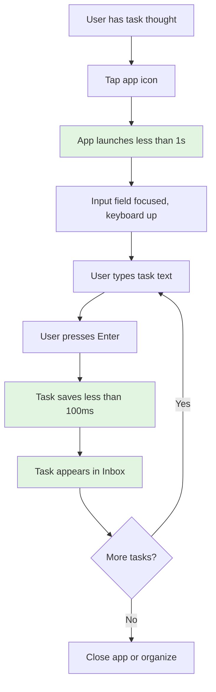
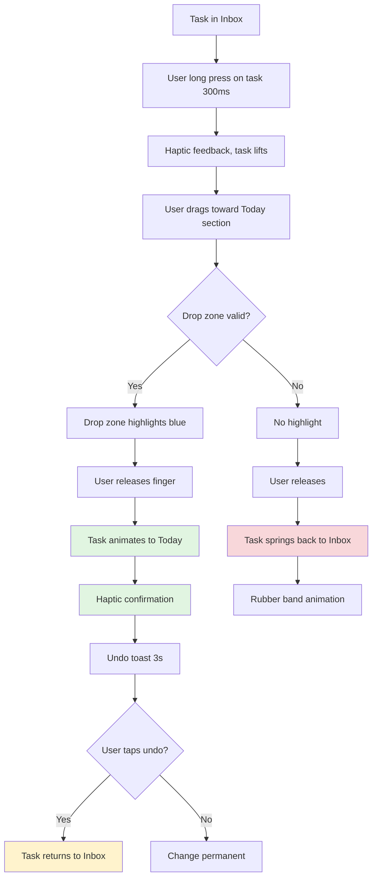
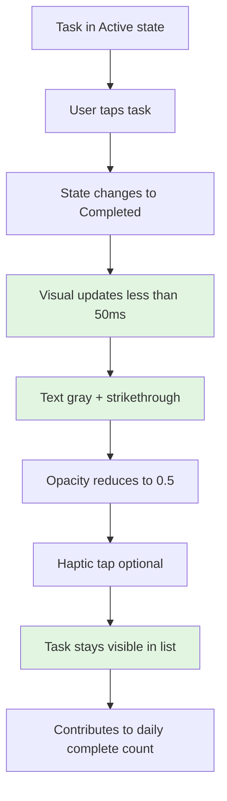
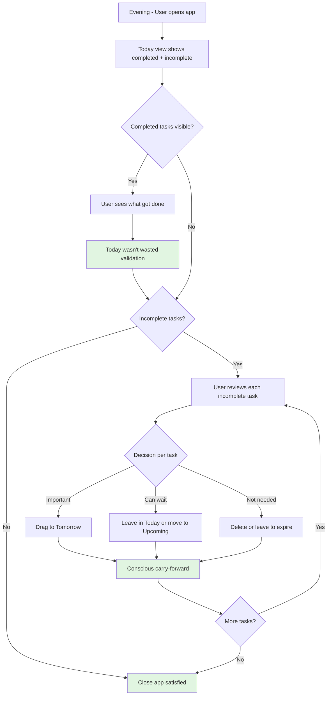

# UX Design Specification Cmpe492

**Author:** Mcan
**Date:** 2026-02-11

---

<!-- UX design content will be appended sequentially through collaborative workflow steps -->

## Executive Summary

### Project Vision

Cmpe492 is a personal task management iOS app that fundamentally reimagines what a to-do app should be. Rather than optimizing for productivity, it optimizes for **clarity and sustainable execution**. The core innovation is combining Notes app-level simplicity with time awareness and behavioral insights to create a system users actually maintain long-term.

The product solves the "complexity-driven abandonment" problem that kills traditional task managers: complexity → broken habits → task accumulation → guilt → permanent abandonment. By maintaining "Notes app DNA" (simple by default, powerful when needed) and giving users agency over task lifecycle, this system prevents the death spiral while providing meaningful visibility into life patterns.

**Design Philosophy:**
- **Notes app that learned about time** - Not a simplified task manager
- **Agency over automation** - Conscious choices, not automatic rollover
- **Clarity over productivity** - Life balance indicators, not productivity metrics
- **Sustainable momentum** - Design prevents abandonment from day one

### Target Users

**Primary User: Self-Directed Builder**

Context-switcher running multiple parallel projects (thesis, personal projects, learning, social obligations) without external structure. Already productive and self-motivated—needs **visibility and clarity** rather than motivation or gamification.

**Core Characteristics:**
- Analytical mind wanting pattern visibility
- Doesn't like rigid systems but needs clarity
- Prefers simplicity over feature-richness
- Values agency over automation
- Currently uses Notes app because it's simple

**Current Pain Points:**
- **Invisible progress anxiety:** "What did I actually do today?"
- **Task drift:** Tasks live in head, postpone silently, never get revisited
- **Death spiral experience:** Previous to-do apps abandoned due to accumulation and guilt
- **Pattern blindness:** Can't see category imbalance or behavioral trends
- **Cognitive overload:** Mental task tracking creates constant background noise

**Usage Context:**
- Morning planning and priority setting
- Throughout-day instant capture (mobile-first)
- Evening review and conscious carry-forward
- Multiple context switching (work, learning, personal, social)

### Key Design Challenges

**1. The 3-Second Capture Challenge**

Must achieve sub-3-second task entry from thought to saved task. This requires a persistent input field that's always accessible but not intrusive, with zero required fields or decisions at capture time. The UX must feel as fast as typing in Notes app.

**2. Spatial Time Manipulation**

Tasks "slide through time" via drag interactions. The three-view system (Inbox for timeless tasks, Today for scheduled work, Upcoming for future) needs intuitive spatial metaphors with fluid, responsive drag operations and immediate visual feedback.

**3. State Visibility Without Clutter**

Three task states (Not Started → Active → Completed) require clear visual differentiation without creating noise. Completed tasks must remain visible for "today wasn't wasted" validation while maintaining clean typography-first design with minimal UI chrome.

**4. Preventing Death Spiral Through Design**

No automatic rollover means end-of-day review must feel natural, not burdensome. Daily view must never exceed comfortable cognitive load (~15 tasks max visible). Return after multi-day gaps must be psychologically safe without intimidating backlog.

**5. Mobile-First Interaction Excellence**

One-handed operation critical for throughout-day capture. Must follow iOS gesture conventions (tap, drag, swipe) while feeling native. Screen real estate optimization essential for iPhone primary use case.

### Design Opportunities

**1. Gestural Time Fluidity**

Create delightful "sliding through time" interactions where swipe gestures enable quick rescheduling. Drag operations become the primary organizing metaphor, making time manipulation feel spatial and intuitive rather than procedural.

**2. Emotional Design for Validation**

Design the "today wasn't wasted" moment at end of day through completed task visibility and simple cumulative analytics. Focus on answering "Did time pass meaningfully?" rather than productivity metrics. Life balance indicators over completion counts.

**3. Progressive Disclosure Excellence**

80% of tasks stay ultra-simple (just text entry), while 20% that need richness (notes, categories, recurring patterns) get it on demand through tap-to-expand and optional fields. Structure emerges naturally from usage rather than being forced at capture.

**4. Native iOS Excellence**

Leverage platform capabilities for delightful interactions: haptic feedback for satisfying task completion, Today widget for glanceable capture and stats, smooth SwiftUI animations for state transitions. Make it feel like it belongs on iPhone.

## Core User Experience

### Defining Experience

The core experience of Cmpe492 revolves around **instantaneous task capture that feels as fast as thought itself**. Every design decision stems from this central truth: if capturing a task takes more than 3 seconds or requires any friction, users will hesitate, and hesitation kills adoption.

The product is fundamentally a **continuous capture-and-organize loop** where users:
1. **Capture instantly** - Type and enter, no decisions required (under 3 seconds)
2. **Organize spatially** - Drag tasks through time and priority when it feels right
3. **See progress clearly** - Completed tasks provide "today wasn't wasted" validation
4. **Choose consciously** - End-of-day review with agency over what carries forward

This is not a productivity optimizer—it's a **clarity tool** that makes invisible progress visible and prevents the death spiral through conscious task lifecycle management.

### Platform Strategy

**iOS Native - Mobile-First Design**

The platform strategy optimizes for **instant accessibility and one-handed operation** on iPhone as the primary device:

**Technical Foundation:**
- SwiftUI for modern, performant native iOS experience
- iOS 15+ targeting iPhone (primary) and iPad (adaptive layout)
- Local-first architecture (Core Data) for maximum speed and 100% offline operation
- Zero network dependency in MVP

**Interaction Model:**
- Touch-first design with native iOS gesture conventions
- One-handed operation for throughout-day capture
- Drag-and-drop as primary organization metaphor
- Tap for state changes, swipe for quick actions

**Platform Constraints:**
- Screen real estate optimization essential for iPhone
- Performance: Maintain 60fps during all drag operations
- Battery efficiency: Minimal background processing
- Privacy: All data stays on device

**Future Platform Considerations (Post-MVP):**
- Today widget for glanceable capture without opening app
- Share sheet integration for task capture from Safari/other apps
- Siri shortcuts for voice-based quick capture
- iCloud sync for multi-device (Phase 3+)

### Effortless Interactions

These interactions must feel completely natural, requiring zero cognitive load:

**1. Task Capture (The Critical Path)**

**Design:** Persistent input field at top of every view, cursor-ready
- User opens app → input field already focused → type → enter → done
- No required fields, no dropdowns, no decisions
- Instant visual feedback (task appears immediately)
- Success metric: Consistently under 3 seconds from app open to task saved

**2. State Changes**

**Design:** Single tap to change task state
- Tap once: Not Started → Active (visual highlight)
- Tap again: Active → Completed (strikethrough, stays visible)
- Immediate visual feedback with smooth animation
- Optional: Haptic feedback for satisfying completion moment

**3. Spatial Time Manipulation ("Sliding Through Time")**

**Design:** Drag tasks between views to reschedule
- Drag from Inbox → Today (scheduling for today)
- Drag from Today → Upcoming (deferring consciously)
- Drag within view to reorder (priority adjustment)
- Visual feedback during drag: semi-transparent preview, drop zones highlight
- Time feels spatial rather than procedural

**4. Completed Task Visibility**

**Design:** Automatic but non-intrusive
- Completed tasks remain visible in Today view automatically
- Visual distinction: Strikethrough text, reduced opacity
- Provides "today wasn't wasted" validation without user action
- No archiving required—cleanup happens naturally at day boundaries

**5. View Navigation**

**Design:** Horizontal swipe between three core views
- Swipe left/right: Inbox ↔ Today ↔ Upcoming
- Tab bar for direct access
- Gestures feel native to iOS
- Current view always clear through visual indicators

### Critical Success Moments

**Moment 1: First Task Capture (Make or Break)**

**When:** Within 30 seconds of first app launch
**Success Criteria:** User creates first task in under 3 seconds
**Why Critical:** If this feels slow or complicated, user won't return
**Design Focus:** Cursor-ready input field, zero friction, instant feedback

**Moment 2: "This Is Faster Than Notes" Realization (Week 1)**

**When:** After 3-5 days of use
**Success Criteria:** User reaches for this app instead of Notes without thinking
**Why Critical:** Proves product replaced existing behavior
**Design Focus:** Maintain Notes-level simplicity while adding time awareness

**Moment 3: "Today Wasn't Wasted" Emotional Validation (Week 2)**

**When:** First end-of-day review with meaningful completed tasks
**Success Criteria:** User feels emotional validation seeing what they accomplished
**Why Critical:** This moment transforms the product from task manager to clarity tool
**Design Focus:** Completed task visibility, clean daily recap, subtle analytics

**Moment 4: End-of-Day Review Without Burden**

**When:** Every evening (ideally 80%+ of days)
**Success Criteria:** Review feels natural, not like homework
**Why Critical:** Conscious carry-forward prevents death spiral
**Design Focus:** Quick gestural processing, agency over automation, guilt-free discarding

**Moment 5: Return After Multi-Day Gap**

**When:** After travel, illness, or busy period (2-3+ days away)
**Success Criteria:** Opening app doesn't feel intimidating or guilt-inducing
**Why Critical:** Most to-do apps fail here through task accumulation
**Design Focus:** Clean slate possible, timeless inbox prevents overwhelming today view

### Experience Principles

**Principle 1: Speed Trumps Everything**

Capture speed is non-negotiable. When in doubt, choose the faster interaction over the more featured one. If a feature adds friction to the core capture loop, it doesn't belong in the primary flow. Progressive disclosure enables richness without compromising speed.

**Principle 2: Agency Over Automation**

Users must consciously choose what happens to their tasks. No automatic rollover, no silent deferrals, no surprises. Automation that removes agency creates distrust. Manual control that feels effortless (through gestures) creates confidence.

**Principle 3: Progressive Disclosure**

80% of tasks stay ultra-simple (just text). The remaining 20% that need richness (categories, notes, recurring patterns) get it on demand through tap-to-expand and optional fields. Structure emerges from usage rather than being forced at capture time.

**Principle 4: Spatial Intuition Over Procedural Steps**

Time and priority should feel spatial through drag interactions rather than procedural through menus and date pickers. "Sliding through time" means dragging a task from Today to Upcoming feels as natural as organizing physical objects on a desk.

**Principle 5: Validation Without Gamification**

Provide evidence of meaningful progress without loud achievements or streak counters. "Today wasn't wasted" is an emotional question answered through visibility and simple analytics, not productivity metrics. Silent insights, not celebrations.

**Principle 6: Native iOS Excellence**

Follow platform conventions religiously. Use standard gestures, respect iOS design patterns, leverage platform capabilities (haptics, widgets). The app should feel like it belongs on iPhone, not like a cross-platform compromise.

## Desired Emotional Response

### Primary Emotional Goals

**Core Emotion: Calm Clarity**

The primary emotional goal is creating a sense of **calm clarity** that replaces invisible progress anxiety. Users should feel mentally lighter after using the product, not from productivity pressure but from making invisible progress visible.

**"Today Wasn't Wasted" Validation**

The defining emotional moment is the end-of-day feeling: "I can see what I did." This isn't about celebrating productivity—it's about **emotional relief from drift anxiety**. The feeling that time passed meaningfully, even if the day felt chaotic.

**Agency Over Overwhelm**

Users should feel **in control** rather than managed by their task list. Conscious choice over task lifecycle creates confidence, while automation creates distrust and eventual abandonment. The emotional goal is empowerment through agency, not efficiency through automation.

**Sustainable Confidence**

Unlike traditional to-do apps that create initial excitement followed by guilt, this product aims for **sustainable confidence**. Users should feel capable of maintaining the system long-term because it never becomes overwhelming or intimidating.

### Emotional Journey Mapping

**Discovery / First Use (Week 1)**

**Target Emotion:** Relief and pleasant surprise
- "This is actually as fast as Notes app"
- "I don't have to fill out a bunch of fields"
- "Finally, something that doesn't feel like homework"

**UX Support:** Cursor-ready input field, instant capture, zero required fields, immediate visual feedback

---

**Daily Core Experience (Throughout Day)**

**Target Emotion:** Frictionless confidence
- No hesitation before opening app
- Capture feels like breathing—natural and effortless
- Moving tasks through time feels intuitive
- State changes feel satisfying (optional haptic feedback)

**UX Support:** Persistent input field, drag-based spatial organization, single-tap state changes, responsive 60fps animations

---

**End of Day Review (Evening)**

**Target Emotion:** "Today wasn't wasted" validation
- Seeing completed tasks creates emotional validation
- Conscious carry-forward feels empowering, not burdensome
- Choosing to let tasks go feels guilt-free
- Closing the app with clear mind

**UX Support:** Completed tasks remain visible with clear distinction, gestural processing, agency over what carries forward, no forced rollover

---

**Weekly Pattern Discovery (Week 2-3)**

**Target Emotion:** Self-awareness without judgment
- Discovering category imbalance: "I'm too focused on work"
- Seeing repeated postponements: "I keep deferring this"
- Pattern visibility creates actionable insights
- Analytics inform rather than pressure

**UX Support:** Simple cumulative analytics, life balance indicators, silent tracking without loud gamification

---

**Long-Term Sustained Use (Month 2+)**

**Target Emotion:** Trust and irreplaceability
- "Can't imagine going back to Notes app"
- "This feels like part of my daily rhythm"
- Returning after multi-day gaps feels safe, not intimidating
- System proves reliable through life interruptions

**UX Support:** Clean slate always possible, timeless inbox prevents overwhelming today view, no death spiral design, data reliability

---

**If Something Goes Wrong (Edge Cases)**

**Target Emotion:** Confidence in recovery, not panic
- App crash: Data persisted immediately, nothing lost
- Multi-day absence: Return feels safe, not overwhelming
- Too many tasks: Timeless inbox provides pressure relief valve
- Changed priorities: Easy to discard or defer without guilt

**UX Support:** Immediate data persistence, forgiving architecture, escape hatches from complexity, agency to reset

### Micro-Emotions

**Confidence → Not Confusion**
- Every interaction has clear visual feedback
- Gestures follow iOS conventions (feel native)
- No hidden features requiring tutorials
- Success paths always obvious

**Trust → Not Skepticism**
- Zero data loss through immediate persistence
- No automatic behavior that surprises users
- Completed tasks stay visible (proof system works)
- Manual control that feels effortless

**Calm → Not Anxiety**
- Capture never overwhelming (always quick)
- Daily view never exceeds cognitive load (~15 tasks visible)
- No accumulation death spiral by design
- End-of-day review feels natural, not homework

**Empowerment → Not Powerlessness**
- User controls all task lifecycle decisions
- Conscious carry-forward (no automatic rollover)
- Guilt-free task discarding
- Agency over automation consistently

**Validation → Not Guilt**
- Completed tasks create "today wasn't wasted" moment
- Progress visibility without productivity pressure
- Life balance indicators, not completion counts
- Silent insights, not loud gamification

**Satisfaction → Not Frustration**
- Sub-3-second capture consistently achieved
- Drag operations feel fluid and responsive
- State changes instant with smooth animations
- Platform-native feel (belongs on iPhone)

### Design Implications

**To Create Calm Clarity:**

**UX Approach:** 
- Typography-first design with minimal UI chrome
- Completed tasks visible but visually distinct (reduced opacity, strikethrough)
- Single manageable view (no tab complexity)
- Clean visual hierarchy focusing attention

**To Create Confidence Through Agency:**

**UX Approach:**
- All task movement user-initiated through gestures
- No automatic rollover or silent deferrals
- End-of-day review with gestural processing
- Escape hatches from any state (can always undo/reset)

**To Create Frictionless Speed:**

**UX Approach:**
- Persistent input field (cursor-ready on app open)
- Zero required fields at capture time
- Enter key saves instantly
- Progressive disclosure (richness on demand)

**To Create "Today Wasn't Wasted" Validation:**

**UX Approach:**
- Completed tasks remain visible in Today view
- Simple cumulative analytics (not productivity metrics)
- Daily recap showing what got done
- Life balance category distribution over time

**To Create Sustainable Momentum:**

**UX Approach:**
- Conscious task lifecycle prevents accumulation
- Timeless inbox as pressure relief valve
- Daily view never overwhelming by design
- Return after gaps feels psychologically safe

**To Create Trust:**

**UX Approach:**
- Immediate data persistence (Core Data)
- Visual feedback for every action
- Predictable behavior (no surprises)
- Local-first reliability (no network dependency)

### Emotional Design Principles

**Principle 1: Validation Without Pressure**

Design for emotional relief, not productivity optimization. Completed task visibility answers "today wasn't wasted" without creating streaks or gamification pressure. Life balance indicators over completion counts.

**Principle 2: Clarity Over Complexity**

Every visual element reduces cognitive load rather than adding it. Typography-first design, purposeful use of color/opacity/weight, whitespace as feature. Information density without clutter.

**Principle 3: Agency Creates Confidence**

User control over all task lifecycle decisions builds trust. Automation that removes agency creates anxiety about what's happening behind the scenes. Manual control that feels effortless (through gestures) creates confidence.

**Principle 4: Immediate Feedback Prevents Anxiety**

Every user action receives instant visual feedback (under 50ms for state changes, under 100ms for task creation). Uncertainty creates anxiety; immediate confirmation creates calm.

**Principle 5: Forgiveness Over Perfection**

Design escape hatches from every state. Tasks can be discarded guilt-free, views can be reset, gaps in usage don't create punishment. Forgiving systems sustain long-term use.

**Principle 6: Native Feel Creates Trust**

Following iOS platform conventions reduces cognitive load and creates subconscious trust. Standard gestures, iOS design patterns, platform capabilities (haptics). The app feels like it belongs on iPhone.

## UX Pattern Analysis & Inspiration

### Inspiring Products Analysis

**Apple Notes - Frictionless Capture Excellence**

The gold standard for instant capture and sustained use. Notes app proves that simplicity enables daily habits through cursor-ready input, automatic save, and zero required fields. Typography-first design with progressive disclosure means 80% of notes stay simple while 20% get rich features on demand. Every gesture follows iOS conventions, creating zero learning curve.

**Key UX Lessons:**
- Instant capture: Opens to blank line, type → auto-save → done
- Visual simplicity: Typography-first, minimal chrome, whitespace as feature
- Progressive disclosure: Rich features available but not required
- Native patterns: Standard iOS gestures feel immediately familiar
- Forgiving: Automatic save eliminates anxiety, undo always available

**Notion - Spatial Drag Organization**

Demonstrates excellent drag-based organization where pages and blocks feel like physical objects. Visual feedback during drag operations provides clear preview of where items will land. Flexible hierarchy through nested dragging creates intuitive spatial relationships. Database Kanban views showcase fluid drag between columns.

**Key UX Lessons:**
- Spatial drag metaphor: Objects feel physical, movement intuitive
- Visual drop zones: Clear indication where items will land
- Semi-transparent preview: Dragged items show translucent copy
- Smooth animations: Fluid 60fps operations feel natural
- Flexible hierarchy: Drag to nest, reorder, or reorganize

**Caution:** Mobile performance can suffer, complexity can creep in over time.

**Asana - Task Drag & Drop Mastery**

Excels at multi-list drag operations with clear visual states for hover, drag, and drop. Reordering within lists through drag provides natural priority adjustment. Mobile implementation smartly uses swipe as drag alternative for one-handed operation. Undo-friendly interactions allow quick mistake reversal.

**Key UX Lessons:**
- Multi-list drag: Smooth movement between sections
- Clear visual states: Distinct feedback for each interaction stage
- Mobile optimization: Swipe alternatives for touch limitations
- Reorder priority: Spatial manipulation for task ordering
- Forgiving: Easy undo for drag mistakes

**Caution:** Mobile drag can be fiddly on smaller screens, structure requirements create friction.

**X (Twitter) - Speed & Satisfying Interactions**

Demonstrates instant feedback excellence where every action receives immediate, satisfying response. Haptic feedback makes interactions feel physical. Infinite scroll and pull-to-refresh use native iOS patterns. Timeline maintains clarity despite dense information. Fast interactions (double-tap, swipe) feel effortless.

**Key UX Lessons:**
- Instant feedback: Every action responds immediately (sub-100ms)
- Haptic feedback: Subtle vibrations create physical interaction feel
- Native gestures: Pull-to-refresh, swipe navigation feel iOS-native
- Visual hierarchy: Clean design despite information density
- Smooth scrolling: 60fps performance feels like butter
- Addictive engagement: Real-time updates, satisfying interactions

### Transferable UX Patterns

**Navigation Patterns:**

**Horizontal Swipe Navigation (X, iOS Photos)**
- Application: Swipe left/right between Inbox ↔ Today ↔ Upcoming
- Why it works: Native iOS pattern, one-handed operation, sequential flow feels natural
- Implementation: Tab bar for direct access plus swipe gestures for flow

**Pull to Refresh (X, Mail)**
- Application: Refresh views or trigger contextual actions
- Why it works: Natural iOS gesture users already know
- Implementation: Subtle animation, feels native, optional end-of-day review trigger

**Interaction Patterns:**

**Drag for Spatial Organization (Notion, Asana)**
- Application: Drag tasks between views for "sliding through time"
- Why it works: Makes time feel spatial (physical) rather than procedural (menus)
- Implementation: Semi-transparent preview, drop zone highlights, 60fps animations, immediate undo

**Swipe Actions as Drag Alternative (Mail, Asana Mobile)**
- Application: Swipe left on task reveals quick actions (Tomorrow, Delete)
- Why it works: Faster than drag on mobile, one-handed friendly
- Implementation: Swipe reveals buttons, further swipe commits action

**Tap for State Changes (X, iOS Toggles)**
- Application: Single tap cycles task state: Not Started → Active → Completed
- Why it works: Fastest possible interaction for most common action
- Implementation: Immediate visual feedback under 50ms, optional haptic on completion

**Instant Capture (Notes)**
- Application: Persistent input field at top of every view, cursor-ready
- Why it works: Zero friction enables sustained daily use
- Implementation: Type → Enter → Saved consistently under 3 seconds

**Visual Patterns:**

**Typography-First Design (Notes, Medium)**
- Application: Minimal UI chrome, text hierarchy does organizational work
- Why it works: Supports "calm clarity" emotional goal, reduces cognitive load
- Implementation: System fonts (San Francisco), clear size hierarchy, generous whitespace, color/opacity for state not decoration

**Satisfying Micro-Interactions (X, iOS)**
- Application: Haptic feedback on task completion, smooth state transition animations
- Why it works: Makes interactions feel physical and rewarding without being loud
- Implementation: Haptic tap on completion, smooth animations, check mark animation, strikethrough effect

**Progressive Disclosure (Notes, Notion)**
- Application: Tasks start simple (text only), richness appears on demand
- Why it works: 80% of tasks stay ultra-simple, 20% get features when needed
- Implementation: Default shows just text, tap to expand reveals notes/categories/dates, swipe reveals quick actions

### Anti-Patterns to Avoid

**Heavy Mobile Performance (Notion)**
- Why to avoid: Lag during drag operations breaks spatial illusion and creates frustration
- Our response: Must maintain 60fps during all drag interactions through optimized Core Data queries and efficient SwiftUI rendering

**Required Structure Upfront (Asana)**
- Why to avoid: Conflicts with instant capture goal, creates friction that kills adoption
- Our response: Inbox-first architecture with zero required fields, progressive disclosure for structure

**Multiple Tabs & Navigation Complexity (Things, Todoist)**
- Why to avoid: Complexity kills habit formation, users abandon when it feels like work
- Our response: Maximum 3 views (Inbox/Today/Upcoming) with simple swipeable navigation

**Automatic Rollover (Traditional To-Do Apps)**
- Why to avoid: Removes agency, creates death spiral through silent task accumulation
- Our response: No automatic rollover, end-of-day review with conscious carry-forward choices

**Delayed Feedback (Slow Apps)**
- Why to avoid: Creates uncertainty and anxiety, breaks flow state
- Our response: Every action receives immediate visual response, local-first architecture with optimistic UI updates

**Feature Overload (Notion/Asana Growth)**
- Why to avoid: Complexity creeps in and eventually kills the simplicity that made it valuable
- Our response: "Notes app DNA" principle - resist feature additions that add friction to core flows

**Productivity Gamification (Streaks, Badges)**
- Why to avoid: Creates pressure and guilt rather than calm clarity
- Our response: Silent analytics focused on "today wasn't wasted" validation, life balance indicators over completion counts

### Design Inspiration Strategy

**What to Adopt Directly:**

**Notes App's Instant Capture**
- Cursor-ready input field on app open
- Type → Enter → Saved (under 3 seconds consistently)
- Zero required fields at capture time
- Rationale: Proven pattern that enables sustained daily use without resistance

**X's Haptic Feedback & Speed**
- Haptic tap on task completion for satisfying physical feedback
- Instant state change animations (under 50ms response)
- Every interaction responds under 100ms
- Rationale: Creates satisfying, physical interactions that build emotional connection

**iOS Native Gestures**
- Swipe between views for horizontal navigation
- Swipe actions for quick operations (Tomorrow, Delete)
- Pull to refresh for view updates
- Rationale: Users already know these patterns, zero learning curve, feels native to platform

**What to Adapt for Our Context:**

**Notion/Asana's Drag Operations → Spatial Time Manipulation**
- Adapt: Drag operations represent time movement, not just reordering
- Our twist: Inbox (timeless) → Today → Upcoming = "sliding through time" spatial metaphor
- Why: Makes abstract time concept tangible and intuitive through physical gesture

**Notion's Progressive Disclosure → Task Richness on Demand**
- Adapt: Content starts simple, reveals complexity progressively
- Our twist: Tasks default to text-only, tap to expand reveals categories/notes/dates
- Why: 80% of tasks stay ultra-simple, 20% that need richness get it when earned through Active state

**X's Timeline Clarity → Task List Visual Design**
- Adapt: Dense information presentation without visual clutter
- Our twist: Typography-first hierarchy with purposeful state indicators (opacity, strikethrough, color)
- Why: Supports "calm clarity" emotional goal while maintaining information density

**What to Explicitly Avoid:**

**Notion's Feature Complexity**
- Why: Direct conflict with "Notes app DNA" philosophy
- Our approach: Defer Phase 2 features aggressively, keep MVP ultra-lean, resist feature creep

**Asana's Required Structure**
- Why: Creates capture friction that kills adoption in first week
- Our approach: Inbox-first with zero structure required, categories/dates fully optional

**Traditional To-Do App Multi-Tab Navigation**
- Why: Complexity kills habit formation, users can't find things, feels like work
- Our approach: 3 simple views maximum, swipeable navigation, single manageable interface

**Productivity Gamification (Streaks, Achievements)**
- Why: Creates pressure and guilt rather than calm clarity we're targeting
- Our approach: Silent analytics, "today wasn't wasted" validation without streaks, life balance over productivity metrics

## Design System Foundation

### Design System Choice

**Apple Human Interface Guidelines + Native SwiftUI Components**

Cmpe492 will use Apple's native design system with SwiftUI components as the foundation. This decision aligns directly with the "Native iOS Excellence" core principle and the "Notes app DNA" philosophy that defines the product.

The design system choice prioritizes platform-native patterns over custom branding, ensuring users experience zero friction from unfamiliar UI patterns and subconscious trust from platform familiarity.

### Rationale for Selection

**Alignment with Core Principles:**

The product's core design principle states: *"Native iOS Excellence - Follow platform conventions religiously. Use standard gestures, respect iOS design patterns, leverage platform capabilities. The app should feel like it belongs on iPhone."* Using Apple's native design system is the only choice that fully delivers on this principle.

**MVP Speed Requirements:**

With a 6-8 week development timeline for MVP and solo developer constraints, building custom components would consume valuable time better spent on core functionality (drag interactions, task management logic, data persistence). Native SwiftUI components work immediately out of the box.

**"Notes App DNA" Achievement:**

The product aspires to feel like "Notes app that learned about time." Native iOS components already match the visual language of Notes, Mail, and Reminders—achieving this design goal automatically without custom work.

**Automatic Accessibility:**

Native SwiftUI components include built-in accessibility support (VoiceOver, Dynamic Type, color contrast, reduced motion) without additional development effort. This is critical for long-term sustainability.

**Performance Optimization:**

Native components are optimized by Apple engineers for iOS. This ensures 60fps animations, efficient memory usage, and smooth drag operations without custom performance tuning.

**Zero Learning Curve:**

Users already know how iOS UI works. Every standard component (TextField, List, TabView, swipe gestures) follows patterns they've used thousands of times in other iOS apps.

**Long-Term Maintenance:**

Apple maintains and updates the design system with each iOS release. The app automatically stays current with platform evolution without manual redesign work.

### Implementation Approach

**Core Strategy: Native First, Custom Only When Necessary**

The implementation follows a strict hierarchy: use native SwiftUI components wherever possible, apply minimal customization for task-specific needs, and only build custom components when essential for core functionality.

**Native SwiftUI Components (Primary):**

**Task Lists:**
- `List` and `ForEach` for task display
- Native swipe actions for delete/quick actions
- Standard iOS list styling and behavior
- Pull-to-refresh using native `.refreshable`

**Task Input:**
- `TextField` with `.textFieldStyle` for task capture
- Native keyboard handling and autocorrect
- Standard submit behavior (return key)

**Navigation:**
- `TabView` for view switching (Inbox/Today/Upcoming)
- Native swipe gestures between views
- Standard iOS navigation patterns

**Standard UI Elements:**
- System fonts (San Francisco)
- System colors with automatic dark mode
- Native spacing and padding
- Safe area insets respected
- Native animations and transitions

**Minimal Customization (Task-Specific):**

**Visual State Differentiation:**
- Opacity adjustments for task states
- Color tinting for Active tasks
- Strikethrough styling for Completed tasks
- Subtle background highlights

**Enhanced Interactions:**
- Custom drag & drop handlers (`.onDrag`/`.onDrop`)
- Haptic feedback on completion (UIImpactFeedbackGenerator)
- Smooth state transition animations
- Semi-transparent drag previews

**Custom Components (Only When Essential):**

**TaskRow Component:**
- Combines native Text, Button, and gesture recognizers
- Manages state display and transitions
- Handles tap and drag interactions
- Still uses native sub-components

**Drag Preview Overlay:**
- Semi-transparent task preview during drag
- Visual indication of drop zones
- Custom but follows iOS visual language

**Completion Animation:**
- Satisfying check mark or strikethrough animation
- Brief but delightful (under 300ms)
- Follows iOS animation curves

### Customization Strategy

**Typography System (San Francisco):**

All typography uses the iOS system font (San Francisco) with semantic text styles:

```
View Headers: .title2 or .title3
Task Text: .body (primary content)
Metadata: .caption or .caption2
Timestamps: .footnote
```

Dynamic Type supported automatically for accessibility.

**Color Palette (iOS System Colors + Semantic):**

**Base Colors:**
- `Color.primary` - Primary text (auto dark mode)
- `Color.secondary` - Secondary text (auto dark mode)
- `Color(.systemBackground)` - Background colors
- `Color(.systemGray)` - Separator lines

**Interactive Colors:**
- `Color.accentColor` / `.blue` - Interactive elements, Active state
- System destructive red for delete actions

**Task State Colors:**
- **Not Started:** Primary text color (default)
- **Active:** Blue accent with subtle blue background tint
- **Completed:** Secondary gray with 50% opacity + strikethrough

All colors automatically adapt to dark mode via system colors.

**Spacing System (iOS Standards):**

Use iOS standard spacing scale:
- 4pt: Tight spacing
- 8pt: Standard spacing
- 16pt: Comfortable spacing (most common)
- 24pt: Section spacing
- 32pt: Large spacing

List padding follows native iOS defaults.

**Component Styling:**

**TextField (Task Input):**
```swift
.textFieldStyle(.plain)
.font(.body)
.padding()
```

**List (Task Display):**
```swift
.listStyle(.plain) // or .inset on iPad
Native row styling with minimal override
```

**TabView (Navigation):**
```swift
.tabViewStyle(.page) for swipe navigation
Native tab bar for direct access
```

**Visual Feedback:**

**Drag & Drop:**
- Drag preview opacity: 0.7
- Drop zone highlight: Blue with 0.2 opacity
- Smooth spring animations

**State Transitions:**
- Animation duration: 200-300ms
- Easing: `.easeInOut` (iOS standard)
- Haptic feedback: `.impact(.light)` on completion

**Design Tokens (SwiftUI):**

```swift
// Task State Visual Differentiation
struct TaskVisuals {
    static let notStartedOpacity: Double = 1.0
    static let activeOpacity: Double = 1.0
    static let completedOpacity: Double = 0.5
    
    static let activeBackground: Color = .blue.opacity(0.1)
    static let dragPreviewOpacity: Double = 0.7
    static let dropZoneOpacity: Double = 0.2
}
```

**Adherence to HIG:**

- Follow iOS Human Interface Guidelines for all interactions
- Standard gesture recognizers (tap, long press, drag, swipe)
- Native navigation patterns
- Platform-appropriate animation curves
- Respect system accessibility settings
- Support dark mode automatically
- Handle safe areas correctly
- Optimize for one-handed use (touch targets 44pt minimum)

**Result:** The app will feel indistinguishable from native iOS apps like Notes, Reminders, and Mail while adding the specific task management interactions (drag between views, state cycling) that make Cmpe492 unique.

## 2. Core User Experience

### 2.1 Defining Experience

**Instant Task Capture: The Defining Interaction**

The defining experience of Cmpe492 is **task capture that feels faster than thought itself**. This is the core interaction that, if perfectly executed, makes everything else follow. When users describe this app to friends, they'll say: *"I can capture a task as fast as typing in Notes, but it actually remembers about time."*

**The "Tinder Swipe" Equivalent:**

Just as Tinder is defined by "swipe to match" and Instagram by "share perfect moments with filters," Cmpe492 is defined by **"capture in under 3 seconds."** This singular interaction determines whether users adopt the product long-term or abandon it after week one.

**Why This Is the Defining Experience:**

From the Product Brief: *"If writing a task takes more than a few seconds, the mind resists. Tasks stay in your head, live in Notes app, or disappear entirely."* The entire product's success hinges on making capture so frictionless that users reach for this app instead of Notes without conscious thought.

**The Success Metric:**

Consistently achieving 2-3 second total capture time from app open to task saved. This isn't arbitrary—it's the threshold where capture feels faster than mental resistance. Above 3 seconds, hesitation creeps in. Below 3 seconds, capture feels effortless.

**The User Promise:**

"Your thoughts become tasks faster than you can think about it." This experience removes the psychological friction that kills traditional to-do apps and makes Cmpe492 the natural replacement for Notes app task capture.

### 2.2 User Mental Model

**Current Mental Model: Notes App Behavior**

Users bring a specific mental model from their current solution (Notes app):

**Expected Behavior:**
1. Open app → cursor immediately ready
2. Type task text → automatic real-time input
3. No forms, no required fields, no decisions
4. Implicit save (no save button exists)
5. Done

**What Users Love:**
- **Instant availability:** No loading screens or delays
- **Zero ceremony:** No setup, no configuration, no structure
- **Automatic save:** Never think about saving
- **Always ready:** Input field always accessible
- **Rapid capture:** Can capture multiple items quickly

**What Users Hate (Traditional To-Do Apps):**
- **Required fields:** Due date, category, priority force decisions
- **Multiple taps:** Create button, form fields, save button
- **Loading delays:** Spinner or blank screen on launch
- **Form interfaces:** Feels like work, not capture
- **Decision paralysis:** Too many choices at wrong time

**The Mental Model Gap:**

Notes app is perfect for capture but lacks time awareness. Traditional to-do apps have time features but kill capture speed through complexity. Users need: **"Notes app simplicity + time awareness without capture friction."**

**User Expectation:**

"It should work exactly like Notes for capture, but magically know about today, tomorrow, and someday." This mental model informs every design decision—anything that slows capture below Notes speed fails the core promise.

**Current Workarounds:**

Users already capture tasks in Notes, then manually transfer to calendar or to-do apps later. This two-step process proves users value capture speed over immediate organization. Our mental model respects this: capture first (Inbox), organize later (drag to Today).

### 2.3 Success Criteria

**Core Experience Success Criteria:**

**Users say "this just works" when:**

1. **Task appears instantly as they type** (< 100ms response time)
   - Characters display without perceptible lag
   - Native TextField responsiveness maintained
   - Feels identical to Notes app typing experience

2. **Hitting Enter saves immediately** (< 100ms from Enter to visible task)
   - No spinner, no delay, no loading state
   - Task appears in list below instantly
   - Smooth slide-in animation completes within 200ms

3. **Cursor returns ready for next capture**
   - Input field clears automatically
   - Focus remains in input field
   - Can immediately type next task (rapid fire)

4. **No forms appear, no required fields**
   - Just text entry, nothing more
   - No date picker popup
   - No category dropdown
   - No priority selector

5. **Consistently achieving 2-3 second total time**
   - App open (1s) + Type (1s) + Save (0-1s) = 2-3s total
   - This becomes muscle memory after 3-5 uses
   - Users stop consciously thinking about the process

**Users feel smart/accomplished when:**

**Rapid Fire Capture:**
- Capturing 5 tasks in 15 seconds (3 seconds per task average)
- Smooth flow state during multi-task capture
- No interruption between tasks

**Zero Resistance:**
- Opening app doesn't feel like "starting a system"
- No mental preparation required
- Reach for app reflexively like Notes

**Behavioral Replacement:**
- Using this instead of Notes without conscious decision
- Friends ask "what app is that?" because it looks so simple
- Can demo the speed to others impressively

**Feedback that tells them it's working:**

**Visual Confirmation:**
- Instant appearance of task in list below input
- Smooth slide-in animation (200ms, gentle ease)
- Task visible with clean typography
- Input field clears confirming save

**Haptic Confirmation (Optional):**
- Light tap on task creation (`.impact(.light)`)
- Physical confirmation without being intrusive
- Respects accessibility settings

**Persistence Confidence:**
- Can close app immediately after capture
- Task will be there when returning
- No "Did it save?" anxiety

**Speed Benchmark:**
- Feels noticeably faster than other to-do apps
- Competitive with Notes app speed
- No perceptible lag at any step

**What happens automatically:**

1. **Task saves to Inbox (timeless holding space)**
   - Default destination requires no user decision
   - ~10 task comfortable carry weight before organizing
   - Pressure relief valve preventing overwhelm

2. **Cursor returns to input for next capture**
   - Automatic focus maintained
   - Ready for rapid-fire multi-task entry
   - No additional tap required

3. **Task appears with default state (Not Started)**
   - Clean, uncluttered initial state
   - No required categorization
   - Progressive disclosure for richness later

4. **Data persists immediately**
   - Core Data write happens instantly
   - Zero data loss risk
   - Can close app with confidence

5. **No additional decisions required**
   - Organization happens later through drag
   - Categories optional (assigned on demand)
   - Dates assigned when moved to Today/Upcoming

### 2.4 Novel UX Patterns

**Primary Pattern: Established (Notes App DNA)**

The core capture experience intentionally uses the proven Notes app pattern that users already love. We don't innovate on capture because the pattern already achieves perfection for this use case.

**Established Pattern Elements:**
- Cursor-ready input field on launch
- Plain text entry with native keyboard
- Automatic save (implicit, not explicit)
- Zero required fields or structure
- Rapid succession capture capability

**Rationale for Established Pattern:**

Innovation on capture would be counterproductive. Users have 5+ years of muscle memory with Notes app. Changing the pattern would add friction precisely where friction is fatal. The goal is **instant familiarity**, not novelty.

**Novel Innovation: Spatial Time Manipulation**

Where we innovate is what happens AFTER capture—organizing tasks through time becomes a spatial, physical interaction rather than a procedural one.

**Novel Pattern: "Sliding Through Time"**

**The Innovation:**
- Drag tasks between views to schedule them
- Inbox (timeless) → Today → Upcoming = spatial time metaphor
- Time movement feels physical, like organizing papers on a desk

**Why Novel:**
- Traditional apps use date pickers and calendar dropdowns for scheduling
- Forms and dialogs make time feel abstract and procedural
- Our approach makes time tangible through drag operations

**The Spatial Metaphor:**

Think of three piles of papers on a desk:
- **Left pile (Inbox):** Things to deal with someday, no urgency
- **Middle pile (Today):** Things I'm working on right now
- **Right pile (Upcoming):** Things for tomorrow and beyond

Dragging a task from Inbox to Today is like physically moving a paper from the "someday" pile to the "now" pile. The spatial metaphor makes time intuitive.

**Teaching Users the Novel Pattern:**

**Discovery Through Interaction:**
1. First task capture goes to Inbox naturally (no decision)
2. User sees task sitting in Inbox section
3. Long press initiates drag (iOS standard pattern)
4. Task lifts visually (familiar iOS drag behavior)
5. Drop zones highlight showing valid targets
6. Releasing over Today moves task there

**Familiar Foundation:**
- Uses iOS native drag & drop patterns
- Follows conventions from Files app, Home screen, Photos
- Long press + drag is established iOS interaction
- Visual affordances guide discovery

**No Tutorial Required:**
- iOS users already know how to drag
- Visual drop zones make targets obvious
- Can experiment safely (undo available)
- Progressive learning through exploration

**Familiar Metaphors:**
- Physical desk organization
- Email triage (Inbox → folders)
- Photo organization (Albums)
- File management (folders)

**Combination of Patterns:**

The innovation isn't inventing new gestures—it's combining established iOS drag patterns with a spatial time metaphor. This creates novelty within familiarity: **users know how to drag, but dragging to schedule through time feels fresh**.

### 2.5 Experience Mechanics

**Core Flow: Instant Task Capture**

**Phase 1: Initiation**

**Trigger:**
- User taps app icon on home screen
- User switches to app from app switcher
- User activates via Siri shortcut (Phase 2+)

**App Launch Sequence (< 1 second):**
1. App icon tap
2. Launch animation (standard iOS)
3. Today view appears
4. Input field at top with focus
5. Keyboard slides up automatically
6. Total time: 800-1000ms on modern devices

**Initial Visual State:**
- **Input field:** Top of screen, cursor blinking, placeholder text "What needs to be done?"
- **Today view:** Visible below input showing today's tasks
- **Keyboard:** Slides up from bottom (iOS standard)
- **Clean interface:** No navigation chrome, minimal UI

**User Readiness:**
- Cursor positioned in input field
- Keyboard ready for typing
- No additional taps required
- Attention focused on single action

**Phase 2: Interaction**

**User Action:**
- User types task text using iOS keyboard
- Example: "Review chapter 3 feedback"
- Uses native typing experience (autocorrect, suggestions, dictation)
- Single line input (no multi-line in MVP)

**Input Behavior:**

**Text Entry:**
- Plain text only (no rich text in MVP)
- Native `TextField` component (SwiftUI)
- Standard iOS text editing (select, cut, copy, paste)
- Autocorrect and predictive text available

**Real-Time Response:**
- Characters appear instantly as typed (< 16ms per character)
- No lag or buffering
- Cursor position updates smoothly
- Feels identical to Notes app

**Submit Trigger:**
- User presses Return/Enter key on keyboard
- Alternative: Submit button visible but not required (Phase 2)
- No other action needed

**System Response (Real-Time):**

**Character Input Processing:**
- Native TextField handles all input
- Zero custom logic during typing
- Maximum performance maintained
- No validation or processing until submit

**Submit Processing (< 100ms total):**

1. **Capture input** (< 10ms)
   - Read text from TextField
   - Trim whitespace
   - Check not empty

2. **Create task entity** (< 20ms)
   - Generate UUID
   - Set text property
   - Set createdAt timestamp
   - Set state: Not Started
   - Set scheduledDate: nil (Inbox)

3. **Persist to Core Data** (< 50ms)
   - Insert into Core Data context
   - Save context
   - Optimistic UI (show before save completes)

4. **Update UI** (< 20ms)
   - Add task to view model
   - Trigger view refresh
   - Start appearance animation

**Phase 3: Feedback**

**Immediate Visual Feedback (< 100ms):**

**Task Appearance:**
- New task appears in Inbox section below input
- Smooth slide-in animation from top (200ms duration)
- Uses `.easeOut` curve for natural feel
- Task visible in default state (body text, primary color)

**Input Field Response:**
- Text clears immediately on submit
- Cursor remains focused in input
- Ready for next task (no additional tap)
- Keyboard stays visible

**Visual Animation Details:**
- Task slides in from above input field
- Subtle fade-in combined with slide (opacity 0 → 1)
- Spring animation for slight bounce (feels alive)
- Animation completes before next input possible

**Haptic Feedback (Optional):**
- Light haptic tap on successful save (`.impact(.light)`)
- Confirms action without being intrusive
- Respects Haptic Feedback accessibility setting
- Only on successful save (not on typing)

**Audio Feedback:**
- None by default (silent operation)
- Respects system silent mode
- No sound effects (maintains calm clarity)

**Error Feedback:**
- Empty task: No-op (nothing happens, no error message)
- Persistence error: Retry automatically, show alert only if repeated failure
- Minimal interruption to flow

**Phase 4: Completion**

**Success State:**

**Task Persisted:**
- Saved to Core Data SQLite database
- Visible in Inbox section
- Assigned UUID for future sync
- Timestamps recorded (createdAt, updatedAt)

**UI State:**
- Input field cleared and focused
- Keyboard still visible
- Cursor blinking in empty input
- User can immediately continue

**Task Properties:**
- **Text:** User-entered content
- **State:** Not Started (default)
- **Location:** Inbox (timeless, scheduledDate = nil)
- **Category:** Uncategorized (optional, assignable later)
- **Notes:** Empty (progressive disclosure)

**What's Next (User Options):**

**Immediate Actions:**
1. **Continue capturing** (most common)
   - Type next task immediately
   - Rapid-fire multiple tasks
   - Build capture momentum

2. **Organize just-created task**
   - Drag to Today if immediate priority
   - Leave in Inbox for later organization
   - Tap to mark Active if starting now

3. **Close app**
   - Task persisted, no manual save needed
   - Can exit immediately with confidence
   - Task will be there on return

4. **Review and organize** (later)
   - End of day review process
   - Batch organization of Inbox tasks
   - Conscious time allocation

**Rapid Capture Flow:**
- User captures 5 tasks in succession (15 seconds total)
- Each task: Type (1-2s) + Enter (instant) + Next (0s) = 1-2s
- Flow state achieved through zero friction
- Momentum builds with each capture

**Error Handling:**

**Empty Input:**
- Action: Nothing happens (no-op)
- Rationale: User pressed Enter by accident
- Feedback: None (silent ignore)
- Cursor remains ready

**Duplicate Tasks:**
- Action: Create task anyway
- Rationale: Intentional duplicates valid (recurring mindset)
- No duplicate detection (Phase 1)

**Persistence Failure:**
- Action: Retry save automatically (3 attempts)
- Feedback: Show alert only if all retries fail
- User option: Try again or dismiss
- Task cached in memory until successful save

---

**Secondary Flow: Spatial Time Manipulation**

**Phase 1: Initiation**

**Trigger:**
- User looks at task in Inbox
- Thinks "I should do this today"
- Wants to schedule without date picker

**Gesture Initiation:**
- Long press on task row (iOS standard)
- Hold for 300ms triggers drag mode
- Haptic feedback confirms drag started (`.impact(.medium)`)

**Visual Feedback (Drag Start):**
- Task lifts slightly (8pt elevation)
- Subtle shadow appears below task
- Task becomes semi-transparent (0.7 opacity)
- Feels like picking up physical object

**Phase 2: Interaction**

**User Action:**
- Drags task toward Today section
- Finger movement controls position
- Can drag within view or between views

**Drag Mechanics:**
- Task preview follows finger smoothly (60fps)
- Slight offset (task centered under finger)
- Smooth tracking with no lag
- Feels like dragging physical paper

**System Response:**

**During Drag:**
- **Task preview:** Semi-transparent copy follows finger
- **Original task:** Remains in place (dimmed 0.3 opacity)
- **Drop zones:** Highlight when drag enters valid area
- **Invalid zones:** No highlight (visual guide)

**Drop Zone Highlighting:**
- Valid target glows with blue tint (0.2 opacity)
- Section expands slightly (8pt padding increase)
- Border appears around drop zone (1pt blue)
- Clear visual invitation to drop

**Phase 3: Feedback**

**During Drag (Continuous):**
- Smooth 60fps tracking
- Drop zones update in real-time
- Haptic tap when entering valid drop zone
- Visual cues guide placement

**On Drop (Release Finger):**

**Valid Drop:**
1. Task animates to final position (300ms)
2. Spring animation for natural feel
3. Opacity returns to 1.0
4. Haptic confirmation (`.impact(.light)`)
5. Original dimmed task fades out

**Invalid Drop:**
1. Task springs back to original position (400ms)
2. Rubber band animation (spring with bounce)
3. No haptic feedback
4. Returns to normal state

**Success Feedback:**
- Task now visible in target section (e.g., Today)
- Undo toast appears briefly (3 seconds)
- Task properties updated (scheduledDate set)
- Clean completion feel

**Phase 4: Completion**

**Success State:**
- Task moved to Today section
- ScheduledDate set to today
- Still in Not Started state
- Undo available (3 second window)

**Data Update:**
- Core Data entity updated
- scheduledDate property set
- updatedAt timestamp recorded
- Change persisted immediately

**What's Next:**
- User can continue organizing other tasks
- Can drag same task to Upcoming if changed mind
- Can tap task to mark Active when ready to start
- Task appears in end-of-day review if incomplete tonight

**Undo Capability:**
- Toast message: "Moved to Today" with Undo button
- 3 second window to undo
- Tap Undo: Task returns to Inbox
- Auto-dismiss after 3s (change permanent)

## Visual Design Foundation

### Color System

**iOS Native Color Strategy**

Cmpe492 uses Apple's semantic color system exclusively, ensuring automatic dark mode support, accessibility compliance, and zero learning curve for iOS users. This approach aligns with the "Native iOS Excellence" principle—the app should feel indistinguishable from Notes, Mail, and Reminders.

**Primary Color Palette (iOS System Colors):**

**Text Colors:**
- **Primary:** `Color.primary` - Main task text (black in light mode, white in dark mode)
- **Secondary:** `Color.secondary` - Metadata, timestamps (adaptive gray)
- **Tertiary:** `Color(.tertiaryLabel)` - Less important information

**Background Colors:**
- **Primary:** `Color(.systemBackground)` - Main view background (white/black adaptive)
- **Secondary:** `Color(.secondarySystemBackground)` - Subtle contrast for sections
- **Grouped:** `Color(.systemGroupedBackground)` - List container backgrounds

**Interactive Colors:**
- **Accent:** `Color.accentColor` / `.blue` - Interactive elements, primary actions
- **Destructive:** `Color.red` - Delete actions, warnings

**Separator & Chrome:**
- **Separators:** `Color(.separator)` - List dividers, borders
- **Subtle borders:** `Color(.systemGray4)` - When borders needed

**Task State Semantic Mapping:**

**Not Started (Default State):**
- Text color: `Color.primary` (full contrast)
- Opacity: 1.0 (fully visible)
- Background: None (transparent)
- Visual appearance: Standard task text

**Active (Current Focus):**
- Text color: `Color.blue` (accent color)
- Background tint: `Color.blue.opacity(0.1)` (10% blue background)
- Opacity: 1.0 (fully visible, high contrast)
- Visual distinction: Blue text + subtle blue background clearly indicates active state

**Completed:**
- Text color: `Color.secondary` (gray, reduced importance)
- Opacity: 0.5 (reduced visual presence)
- Text decoration: Strikethrough (`.strikethrough()` modifier)
- Rationale: Stays visible for "today wasn't wasted" validation without competing with active tasks

**Dark Mode Strategy:**

All colors automatically adapt through iOS system color APIs. No custom dark mode logic required—Apple's semantic colors handle this perfectly:

- Light mode: Black text on white, blue accent
- Dark mode: White text on black, blue accent (adjusted for dark)
- Transitions: Smooth, automatic, follows system setting

**Accessibility & Contrast:**

- **WCAG 2.1 AA Compliance:** System colors meet contrast requirements automatically
- **High Contrast Mode:** System colors adapt when user enables high contrast accessibility setting
- **Color Independence:** State isn't conveyed by color alone (also uses opacity, strikethrough, background tints)
- **Multiple Indicators:** Each state has 2-3 visual differentiators for comprehension without color

### Typography System

**San Francisco (SF Pro) - iOS System Font**

All typography uses Apple's San Francisco system font, providing excellent readability, comprehensive character support, and automatic Dynamic Type scaling for accessibility.

**Semantic Text Styles (iOS Standard):**

**Headers & Titles:**
- `.title` (34pt Bold) - Rarely used, main app title only if needed
- `.title2` (22pt Bold) - Major section headers if needed
- `.title3` (20pt Semibold) - View titles ("Today", "Inbox", "Upcoming")

**Content:**
- `.body` (17pt Regular) - **PRIMARY: Task text** (most important element)
- `.callout` (16pt Regular) - Supporting content, annotations
- `.caption` (12pt Regular) - Timestamps, metadata, category tags
- `.caption2` (11pt Regular) - Fine print if needed
- `.footnote` (13pt Regular) - Secondary information

**Task List Typography Application:**

**Task Text:** `.body` (17pt Regular)
- Primary content, most prominent
- Comfortable reading size
- Clear even with reduced opacity when completed

**View Headers:** `.title3` (20pt Semibold)
- "Inbox", "Today", "Upcoming" section headers
- Subtle hierarchy without overwhelming
- Clear navigation context

**Metadata:** `.caption` (12pt Regular)
- Timestamps (Phase 2+)
- Category tags (Phase 2+)
- Supporting information

**Input Placeholder:** `.body` with `Color.secondary`
- "What needs to be done?"
- Same size as task text for consistency
- Lower contrast to indicate placeholder state

**Font Weights:**

- **Regular (400)** - Default for all body content and task text
- **Semibold (600)** - Headers and view titles for subtle hierarchy
- **Bold (700)** - Rarely used, only for major emphasis if needed

**Dynamic Type Support:**

All text automatically scales with user's system-wide text size preference (Settings → Accessibility → Display & Text Size → Larger Text). Semantic text styles handle this automatically:

- Small sizes: Task text remains readable
- Large sizes: Task list adapts vertically, maintains readability
- Extra large: Full accessibility support for vision needs
- No custom code needed—SwiftUI handles scaling

**Typography Hierarchy Principles:**

1. **Task text is the hero** - Largest readable size (body), full attention
2. **Headers provide context** - Slightly larger (title3), semibold for distinction
3. **Metadata is subtle** - Smaller (caption), secondary color, doesn't compete
4. **Minimal variety** - 3-4 text styles maximum maintains calm clarity
5. **Consistency** - Same style always means same thing (no exceptions)

**Line Height & Spacing:**

Native SwiftUI text styles include optimal line height and letter spacing automatically. No custom values needed—Apple's designers have optimized these for readability.

**Typography Philosophy:**

"Typography-first design where text hierarchy does organizational work without visual chrome." The difference between a header and body text should be obvious through size and weight alone, not through boxes, backgrounds, or decorative elements.

### Spacing & Layout Foundation

**iOS Standard Spacing System**

**Base Unit: 4pt** (iOS design standard)

This 4pt base unit aligns with iOS conventions and ensures consistency across all platform apps. All spacing values are multiples of 4pt.

**Spacing Scale:**

- **4pt** - Tight spacing (minimal gaps between closely related items)
- **8pt** - Compact spacing (related elements like icon and label)
- **16pt** - **Standard spacing (default for most UI elements)** ← Most common
- **24pt** - Comfortable spacing (section breaks, grouped content)
- **32pt** - Large spacing (major section separation)
- **44pt** - Minimum touch target height (iOS HIG requirement)

**Component-Specific Spacing:**

**Task List Rows:**
- Row height: Auto-calculated (minimum 44pt for touch targets)
- Internal padding: 16pt horizontal, 12pt vertical
- Separator inset: 16pt from leading edge
- Touch target: Full row width and height (minimum 44pt)

**Input Field (Task Capture):**
- Top padding: 16pt from safe area top
- Bottom padding: 8pt from task list
- Internal padding: 12pt horizontal, 16pt vertical
- Persistent at top of all views (Inbox, Today, Upcoming)

**Section Spacing:**
- Between Inbox/Today/Upcoming sections: 24pt
- Section headers: 8pt top padding, 4pt bottom padding
- First item below header: 4pt gap

**List Layout:**
- Edge insets: System default (16-20pt varies by device/context)
- Content insets: Respects safe areas automatically
- Separator lines: System default (hairline, 1px)

**Touch Target Optimization:**

- **Minimum size:** 44pt x 44pt (iOS Human Interface Guidelines requirement)
- **Task rows:** 44pt+ height (auto-expands for Dynamic Type)
- **Tap areas:** Extend to full row edges for easy interaction
- **One-handed reach:** Primary actions within thumb reach zone

**Safe Areas & Margins:**

SwiftUI automatically respects iOS safe areas:
- **Notch/Dynamic Island:** Content flows around automatically
- **Home indicator:** Bottom content doesn't obscure gesture area
- **Status bar:** Top content respects status bar height
- **Keyboard:** Views adjust when keyboard appears

No custom safe area logic needed—native behavior handles all edge cases perfectly.

**Grid System:**

iOS uses **flow layout** rather than rigid grid:

- **Vertical flow:** Content stacks vertically in scrolling lists
- **Full width:** UI elements use full available width (minus system margins)
- **Adaptive:** Automatically adjusts for device size (iPhone SE to iPad)
- **No columns:** Single-column layout for clarity and focus

**Layout Density Philosophy:**

**Comfortable, Not Cramped:**

- Generous tap targets (44pt minimum) prevent mis-taps
- Readable text size (17pt body) without squinting
- Breathing room between tasks (12pt vertical padding)
- Whitespace as feature, not wasted space

**Visual Priority:**

- Most space dedicated to task text (hero content)
- Headers use minimal vertical space (don't compete)
- Input field always visible at top (persistent)
- Completed tasks visible but reduced opacity (don't overwhelm)

**Adaptive Layout:**

- **iPhone (Portrait):** Single column, full width tasks
- **iPhone (Landscape):** Same layout (maintains simplicity)
- **iPad:** Potentially wider margins, but same core layout (Phase 2+)
- **Multitasking:** Adapts gracefully to narrow widths

**Layout Principles:**

1. **Typography-first:** Text hierarchy creates structure without visual chrome
2. **Generous whitespace:** Breathing room reduces cognitive load
3. **Single-column focus:** One task at a time, no distractions
4. **Persistent input:** Task capture always at top, always accessible
5. **Flow, not grid:** Content flows naturally, adapts to Dynamic Type

### Accessibility Considerations

**Automatic Accessibility Through Native Components**

Using native SwiftUI components provides comprehensive accessibility support without custom implementation work. Apple has built world-class accessibility into the platform—we inherit it all.

**Visual Accessibility (Automatic):**

**Dynamic Type:**
- All text scales automatically with system text size preference
- Users set size once (Settings → Accessibility → Display & Text Size)
- App respects preference automatically
- Task list adapts vertically, maintains readability
- No maximum size—supports extreme vision accessibility needs

**High Contrast Mode:**
- System colors automatically adapt when user enables high contrast
- Increased contrast ratios for better visibility
- Separator lines become more visible
- Text becomes bolder/higher contrast
- No custom logic needed

**Reduce Transparency:**
- Background tints (Active task blue background) respect this setting
- System reduces opacity/transparency effects when enabled
- Improves clarity for users with vision challenges
- Automatic through system color usage

**Color Contrast:**
- System colors meet WCAG 2.1 AA standards automatically
- Primary text: 7:1+ contrast ratio
- Secondary text: 4.5:1+ contrast ratio
- Interactive elements: 3:1+ contrast ratio

**Motor Accessibility:**

**Touch Targets:**
- 44pt x 44pt minimum size (iOS HIG requirement)
- Enforced through native list rows and buttons
- Full-width tap areas make targeting easy
- Forgiving targets for users with motor control challenges

**Drag & Drop:**
- iOS provides accessible alternatives automatically
- VoiceOver users can drag without visual drag gesture
- Accessible drag announcements and completion feedback
- Standard iOS patterns users already know

**Keyboard Navigation (iPad):**
- Tab key moves between interactive elements
- Return/Enter key activates buttons
- Arrow keys navigate lists
- Standard iOS keyboard shortcuts work

**VoiceOver Support (Screen Reader):**

**Automatic Labels:**
- Native components have built-in accessibility labels
- Task text: Read as-is (body content)
- Buttons: Descriptive labels ("Mark as active", "Complete task")
- Input field: "Task input field" with placeholder hint

**State Announcements:**
- Task state announced: "Active", "Completed", "Not Started"
- List position: "Item 3 of 7"
- Section headers: "Today section, 5 items"
- Changes announced: "Task marked as complete"

**Gestures:**
- Double tap: Activate (standard VoiceOver gesture)
- Swipe up/down: Access custom actions menu
- Swipe left/right: Navigate items
- Standard iOS VoiceOver gestures work everywhere

**Drag Operations:**
- VoiceOver announces drag start
- Drop zones announced as user navigates
- Successful drop confirmed audibly
- Alternative: Use actions menu instead of drag

**Reduce Motion:**

Respects `.accessibilityReduceMotion` system setting:
- Animations simplified or disabled when enabled
- Drag operations still work, just without fancy animations
- State transitions instant instead of animated
- Content appears/disappears without motion effects
- Maintains full functionality, just removes visual motion

**Color Independence:**

State is never conveyed by color alone (WCAG requirement):

**Not Started:**
- Indicator: Standard text appearance
- Color: Primary (black/white)

**Active:**
- Indicator 1: Blue text color
- Indicator 2: Subtle blue background tint
- Multiple cues ensure comprehension without color perception

**Completed:**
- Indicator 1: Gray text color
- Indicator 2: Strikethrough text decoration
- Indicator 3: Reduced opacity (0.5)
- Three visual differentiators work without color

**Focus Indicators:**

- Native SwiftUI focus rings appear automatically
- Keyboard navigation shows clear focus state
- High contrast focus rings in accessibility modes
- Focus follows logical navigation order

**Haptic Feedback:**

- Optional, respects system haptic settings
- Disabled if user has turned off haptics system-wide
- Provides tactile confirmation for users who benefit
- Never sole indicator of action completion

**Additional Accessibility Commitments:**

**Text Alternatives:**
- All interactive elements have descriptive labels
- Actions clearly named ("Complete task", not "Checkmark")
- Context provided where needed

**Consistent Patterns:**
- Same gesture always does same thing
- Predictable behavior reduces cognitive load
- Standard iOS patterns users already know

**Error Prevention:**
- Undo available for all destructive actions
- Confirmation for permanent deletions (if implemented)
- Forgiving interaction model

**Accessibility Philosophy:**

"World-class accessibility through native components, not custom implementations." By using iOS native patterns exclusively, we inherit Apple's decades of accessibility engineering and ensure the app works perfectly with all iOS accessibility features—VoiceOver, Dynamic Type, Switch Control, Voice Control, and more.

**Result:** The app is accessible to users with visual, motor, hearing, and cognitive disabilities without additional development work. This is the power of platform-native design.

## Design Direction Decision

### Design Direction Philosophy

**iOS Native: The Only Direction**

Cmpe492 does not explore multiple design directions because the product philosophy explicitly defines the visual approach from the outset. The core principle of "Native iOS Excellence" and "Notes app DNA" means there is only one design direction: **look and feel exactly like a native iOS app built by Apple.**

**Why No Alternative Directions:**

This isn't a typical product where visual branding, custom color schemes, or unique layouts create differentiation. The entire value proposition depends on feeling native:

- Users must think "This could be a default iOS app"
- Zero learning curve requires standard iOS patterns
- "Notes app DNA" means matching Notes' visual language exactly
- Differentiation comes from functionality (time awareness, task states), not visual design

**The Singular Direction:**

"Indistinguishable from Notes, Mail, and Reminders, with task management features seamlessly integrated."

### Chosen Direction: iOS Native

**Visual Approach:**

The app uses Apple's native design system exclusively:

**Layout:** 
- Standard iOS list layout (like Reminders, Notes)
- Persistent input field at top (like Messages, Notes)
- Vertical scrolling list below
- Tab bar for view switching (Inbox/Today/Upcoming)
- Single-column, full-width layout

**Colors:**
- iOS system colors exclusively
- Automatic dark mode through semantic colors
- Blue accent for interactive elements and Active state
- Gray for completed tasks with reduced opacity

**Typography:**
- San Francisco (SF Pro) system font
- Semantic text styles (.body for tasks, .title3 for headers)
- Dynamic Type support automatic
- 17pt body text for comfortable reading

**Spacing:**
- iOS standard spacing scale (4pt, 8pt, 16pt, 24pt, 32pt)
- 44pt minimum touch targets
- 16pt standard padding
- System-provided list insets and margins

**Interactions:**
- Native iOS gestures (tap, long press, drag, swipe)
- Standard list row behavior
- iOS drag & drop patterns
- Native TextField with keyboard handling

**Components:**
- SwiftUI List for task display
- SwiftUI TextField for task input
- Native TabView for navigation
- Standard iOS animations and transitions

### Design Rationale

**Alignment with Core Principles:**

**"Native iOS Excellence"**
Using Apple's design system isn't a compromise—it's the strategy. The principle states: *"Follow platform conventions religiously. Use standard gestures, respect iOS design patterns, leverage platform capabilities. The app should feel like it belongs on iPhone."*

Any custom visual direction would violate this principle.

**"Notes App DNA"**
The product aspires to feel like "Notes app that learned about time." This requires matching Notes' visual language exactly:
- Same typography (SF Pro, body text)
- Same colors (system black/white, minimal chrome)
- Same layout (input at top, list below)
- Same simplicity (typography-first, minimal UI)

**Speed Requirement:**
Sub-3-second task capture requires zero visual friction. Users must recognize the interface instantly from Notes app muscle memory. Novel visual design would add cognitive load at the worst possible moment.

**Accessibility Built-In:**
Native iOS components provide world-class accessibility automatically. Custom designs would require extensive custom accessibility implementation and testing.

**Long-Term Maintenance:**
Apple maintains and updates the design system with each iOS release. The app automatically stays current with platform evolution without redesign work.

**User Trust:**
Users subconsciously trust apps that follow platform conventions. Native appearance signals reliability, privacy, and quality without explicit communication.

### Implementation Approach

**Development Strategy:**

**Use Native Components Exclusively:**
- SwiftUI List, TextField, TabView, Button
- Standard iOS controls and patterns
- System animations and transitions
- Native gesture recognizers

**Minimal Customization:**
- Task state visual differentiation (opacity, color, strikethrough)
- Drag & drop handlers (still using iOS patterns)
- Optional haptic feedback
- State transition animations (using iOS animation curves)

**Custom Components Only When Essential:**
- TaskRow (combines native Text, Button, gesture handlers)
- Drag preview overlay (follows iOS visual language)
- Completion animation (brief, follows iOS style)

**No Custom Design Work:**
- No custom color palettes
- No custom typography
- No custom spacing systems
- No custom navigation patterns
- No custom component libraries

**Result:**

The app will be visually indistinguishable from Notes, Reminders, and Mail. Users won't consciously notice the design—which is the goal. The design disappears, letting tasks be the focus.

**Design Direction Success Metric:**

Users should be unable to identify that this isn't an Apple-built default iOS app based on visual appearance alone. Differentiation comes entirely from functionality (task states, time organization, drag-based scheduling), not visual design.

## User Journey Flows

### Journey 1: Fast Task Capture (Core Flow)

**Goal:** Capture task in under 3 seconds from app open to saved



**Flow Details:**
- **Entry:** App icon tap or app switcher
- **Success:** Task visible in Inbox, input ready for next
- **Time:** 2-3 seconds total
- **Error handling:** Empty input = no-op (silent)
- **Recovery:** Undo not needed (capture is non-destructive)

### Journey 2: Spatial Time Manipulation

**Goal:** Move task from Inbox to Today through drag



**Flow Details:**
- **Entry:** Long press on any task
- **Success:** Task moved to target view, scheduled
- **Feedback:** Visual (lift), haptic (start/end), undo toast
- **Error:** Invalid drop returns to origin
- **Recovery:** 3-second undo window

### Journey 3: State Change (Active to Completed)

**Goal:** Mark active task as completed



**Flow Details:**
- **Entry:** Tap on task row
- **Success:** Visual state change, stays visible
- **Time:** < 50ms response
- **Validation:** "Today wasn't wasted" provided
- **Behavior:** No removal (stays for validation)

### Journey 4: End-of-Day Review

**Goal:** Consciously decide what carries forward



**Flow Details:**
- **Entry:** Natural evening app check
- **Success:** Conscious decisions made, clear mind
- **No automatic rollover** (prevents death spiral)
- **Agency:** User controls all task movement
- **Option:** Guilt-free discarding available

### Journey Patterns

**Pattern 1: Immediate Feedback Loop**

Every user action receives instant visual feedback:
- Tap → Visual change <50ms
- Drag start → Haptic + lift <100ms
- Task create → Appear <100ms
- State change → Update <50ms

**Pattern 2: Undo-Friendly Operations**

All destructive or significant actions have undo:
- Task movement: 3-second undo toast
- Task completion: Tap again to uncomplete
- Task deletion: Could add undo (Phase 2)

**Pattern 3: Progressive Disclosure**

Information appears when needed, not before:
- Task capture: Just text, no fields
- Organization: Drag when ready, not at capture
- Details: Tap to expand (Phase 2)
- Categories: Assign on demand (Phase 2)

**Pattern 4: Spatial Metaphor**

Time and organization use physical metaphors:
- Drag = Physical movement through time
- Views = Spatial locations (Inbox, Today, Upcoming)
- Reorder = Priority through vertical position
- Touch = Direct manipulation of tasks

**Pattern 5: Non-Blocking Flow**

No operation blocks the next action:
- Task saves optimistically (show before DB write)
- Input field immediately ready for next capture
- State changes instant, don't wait for animation
- Can close app immediately after any action

### Flow Optimization Principles

**Principle 1: Speed Over Everything**

Every flow optimized for minimum time to value:
- Task capture: 2-3 seconds
- State change: < 50ms
- Organization: Single gesture (drag)
- No multi-step wizards or forms

**Principle 2: Zero Cognitive Load**

Decision points minimized:
- Capture: No decisions required
- Default destination: Inbox (timeless)
- State: Obvious (tap to progress)
- Organization: Spatial (drag where it goes)

**Principle 3: Forgiveness First**

Users can't break anything:
- No permanent deletion without confirmation
- Undo available for significant actions
- Invalid actions fail gracefully (rubber band)
- Can always return to clean slate

**Principle 4: Visible Progress**

Users always know what happened:
- Tasks appear immediately when created
- State changes visible instantly
- Movement animations show destination
- Undo toasts confirm actions

**Principle 5: Agency Over Automation**

Users control all task lifecycle:
- No automatic rollover (conscious choice)
- No automatic categorization
- No automatic scheduling
- Manual control that feels effortless through gestures

**Principle 6: "Today Wasn't Wasted"**

Completed tasks stay visible for validation:
- Don't hide completed tasks
- Show at end of day for review
- Contribute to cumulative analytics
- Provide emotional relief from drift anxiety

## Component Strategy

### Design System Components (Native SwiftUI)

**Available from SwiftUI (Our Design System):**

**Foundation Components:**
- `TextField` - Task input capture
- `List` - Task list display
- `ForEach` - List iteration
- `Text` - All text display
- `Button` - Actions if needed
- `TabView` - Navigation between views
- `ScrollView` - Vertical scrolling
- `VStack/HStack` - Layout stacking

**All components needed are available natively.** No component gaps exist because we chose native iOS design system.

### Custom Components

**Only 3 Custom Components Needed:**

**1. TaskRow Component**

**Purpose:** Display single task with all states and interactions

**Anatomy:**
- Task text (`.body` typography)
- State visual (color, opacity, strikethrough)
- Tap gesture recognizer
- Long press for drag initiation
- Swipe actions (Phase 2)

**States:**
- Not Started: Primary color, 1.0 opacity
- Active: Blue color, blue 0.1 background
- Completed: Secondary color, 0.5 opacity, strikethrough

**Variants:** None (consistent appearance)

**Accessibility:**
- Label: Task text content
- Trait: Button (tappable)
- Value: "Not started", "Active", or "Completed"
- Actions: "Mark as active", "Mark as complete"

**2. PersistentInputField Component**

**Purpose:** Always-visible task capture input

**Anatomy:**
- `TextField` with `.body` font
- Placeholder: "What needs to be done?"
- Auto-focus on view appear
- Submit action on Enter/Return

**States:**
- Empty (placeholder visible)
- Typing (user entering text)
- Error: None (no validation)

**Variants:** None

**Accessibility:**
- Label: "Task input field"
- Hint: "Enter task and press return to save"
- Keyboard type: Default
- Return key: Done

**3. DragPreview Component (Minor)**

**Purpose:** Semi-transparent preview during drag

**Anatomy:**
- Copy of TaskRow at 0.7 opacity
- Follows finger during drag
- Slight shadow for elevation

**States:**
- Dragging (visible, follows finger)
- Not dragging (hidden)

**Accessibility:**
- VoiceOver announces: "Dragging [task name]"
- Alternative: Actions menu for VoiceOver users

### Component Implementation Strategy

**Strategy: Native-First with Minimal Custom**

**Foundation:**
- Use SwiftUI native components for 95% of UI
- Custom components are thin wrappers combining native elements
- No custom component library needed

**Custom Component Approach:**
1. Build using SwiftUI standard components
2. Apply design tokens (colors, typography, spacing)
3. Add gesture recognizers for interactions
4. Ensure accessibility through native APIs

**Consistency:**
- All custom components use system colors
- All custom components use semantic text styles
- All custom components follow iOS gesture patterns
- All custom components respect accessibility settings

**Reusability:**
- TaskRow used everywhere tasks appear
- PersistentInputField at top of all views
- DragPreview reused for all drag operations

### Implementation Roadmap

**Phase 1 - MVP (Weeks 1-6):**

**Week 1-2:**
- TaskRow component (Not Started, Active, Completed states)
- PersistentInputField component (capture functionality)
- Basic List layout (Today view)

**Week 3-4:**
- Drag & drop functionality (TaskRow → views)
- DragPreview component
- Tab navigation (Inbox/Today/Upcoming)

**Week 5-6:**
- State change interactions (tap to cycle states)
- Undo toast (minor component)
- Polish animations and haptics

**Phase 2 - Enhanced Features (Post-MVP):**
- Swipe actions component (delete, tomorrow)
- Category tag component (optional assignment)
- Analytics display components (simple stats)
- End-of-day review workflow components

**Phase 3 - Advanced Features (Future):**
- Widget components (iOS 14+)
- Recurring task UI components
- Notes detail view component (tap to expand)
- Advanced filtering UI

**No Component Library Needed:**
Native SwiftUI provides all foundation components. Only 3 custom components needed for MVP, all lightweight wrappers around native elements.
